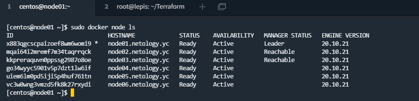
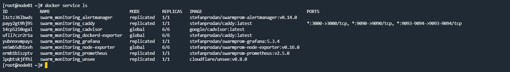
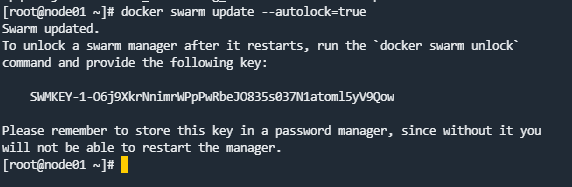

# Домашнее задание к занятию "5. Оркестрация кластером Docker контейнеров на примере Docker Swarm"

## Задача 1

Дайте письменые ответы на следующие вопросы:

- В чём отличие режимов работы сервисов в Docker Swarm кластере: replication и global?  
Для реплицированного сервиса вы указываете, сколько идентичных задач хотите запустить. Глобальный сервис запускает одну задачу на каждой ноде. Предварительно заданного количества задач нет. Каждый раз, когда вы добавляете ноду в swarm, оркестратор создает задачу, а планировщик назначает задачу новой ноде 
- Какой алгоритм выбора лидера используется в Docker Swarm кластере?  
Для обеспечения отказоустойчивости в Docker Swarm обычно создают несколько серверов с ролью менеджера, и из них будет избираться лидер по алгоритму Raft, и эта нода теперь имеет роль Leader node. При выходе из строя лидера, начинается "голосование". Лидером станет нода, которая получет наибольшее количество запросов, если таких нод будет несколько, то ноды ждут случайное количество времени и проводят новое "голосование"
- Что такое Overlay Network?  
Создается подсеть, которую могут использовать контейнеры в разных хостах swarm-кластера. Контейнеры на разных физических хостах могут обмениваться данными по overlay-сети (если все они прикреплены к одной сети).

## Задача 2

Создать ваш первый Docker Swarm кластер в Яндекс.Облаке

Для получения зачета, вам необходимо предоставить скриншот из терминала (консоли), с выводом команды:
```
docker node ls
```  
Решение: 
## Задача 3

Создать ваш первый, готовый к боевой эксплуатации кластер мониторинга, состоящий из стека микросервисов.

Для получения зачета, вам необходимо предоставить скриншот из терминала (консоли), с выводом команды:
```
docker service ls
```  
Решение:

## Задача 4 (*)

Выполнить на лидере Docker Swarm кластера команду (указанную ниже) и дать письменное описание её функционала, что она делает и зачем она нужна:
```
# см.документацию: https://docs.docker.com/engine/swarm/swarm_manager_locking/
docker swarm update --autolock=true
```  
Решение:  
  
Дополнительная безопасность, шифрует логи Raft и TLS ключ используемый для шифрования взаимодействия между нодами другим ключом. После перезагрузки необходимо будет ввести ключ расшифровки для успешной работы ноды
