1. Узнайте о sparse (разряженных) файлах.  
Решение:
* Разрежённый файл (англ. sparse file) — файл, в котором последовательности нулевых байтов[1] заменены на информацию об этих последовательностях (список дыр).  
* Дыра (англ. hole) — последовательность нулевых байт внутри файла, не записанная на диск. Информация о дырах (смещение от начала файла в байтах и количество байт) хранится в метаданных ФС. 
2. Могут ли файлы, являющиеся жесткой ссылкой на один объект, иметь разные права доступа и владельца? Почему?  
Решение: Нет, у них один номер Innode
3. Сделайте vagrant destroy на имеющийся инстанс Ubuntu. Замените содержимое Vagrantfile следующим:
```
Vagrant.configure("2") do |config|  
config.vm.box = "bento/ubuntu-20.04"  
  config.vm.provider :virtualbox do |vb|  
    lvm_experiments_disk0_path = "/tmp/lvm_experiments_disk0.vmdk"  
    lvm_experiments_disk1_path = "/tmp/lvm_experiments_disk1.vmdk"  
    vb.customize ['createmedium', '--filename', lvm_experiments_disk0_path, '--size', 2560]  
    vb.customize ['createmedium', '--filename', lvm_experiments_disk1_path, '--size', 2560]  
    vb.customize ['storageattach', :id, '--storagectl', 'SATA Controller', '--port', 1, '--device', 0, '--type', 'hdd', '--medium', lvm_experiments_disk0_path]  
    vb.customize ['storageattach', :id, '--storagectl', 'SATA Controller', '--port', 2, '--device', 0, '--type', 'hdd', '--medium', lvm_experiments_disk1_path]  
  end  
end
```  
Решение:  
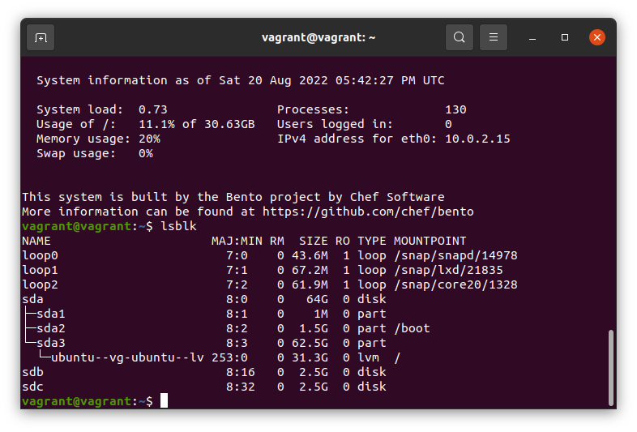  
4. Используя fdisk, разбейте первый диск на 2 раздела: 2 Гб, оставшееся пространство.  
Решение:  
  
5. Используя sfdisk, перенесите данную таблицу разделов на второй диск.  
Решение: 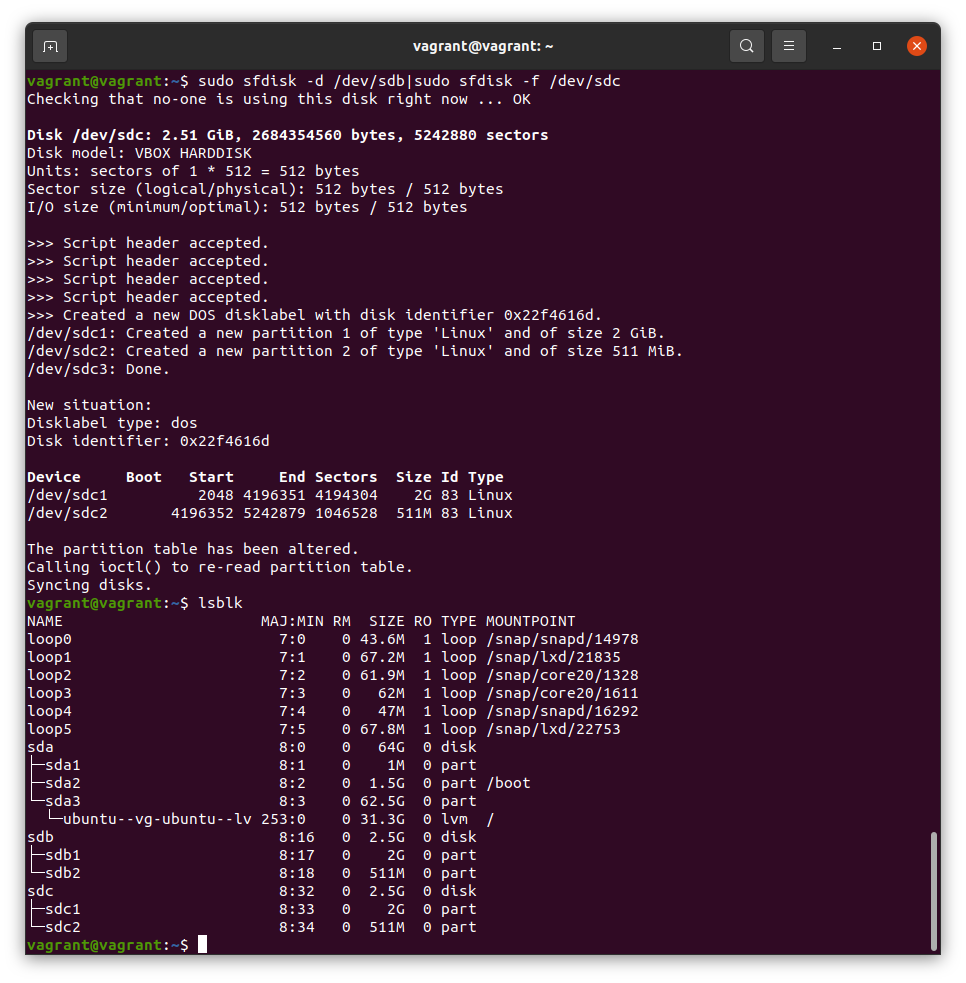  
6. Соберите mdadm RAID1 на паре разделов 2 Гб.  
Решение: 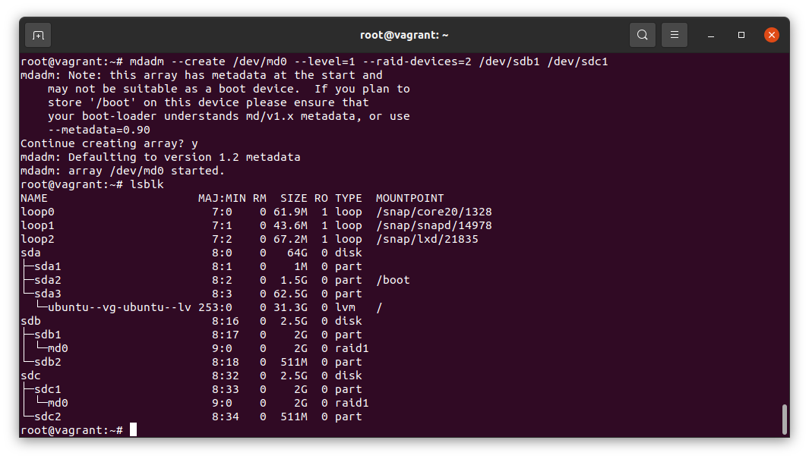  
7. Соберите mdadm RAID0 на второй паре маленьких разделов.  
Решение: 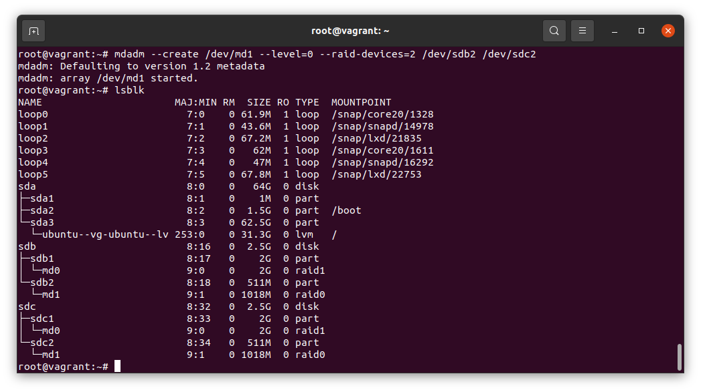  
8. Создайте 2 независимых PV на получившихся md-устройствах.  
Решение: 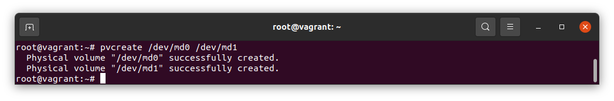  
9. Создайте общую volume-group на этих двух PV.  
Решение: 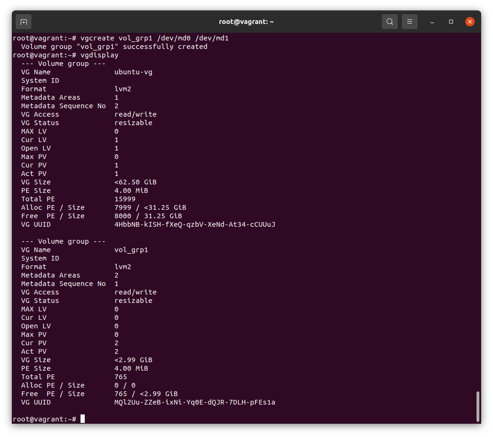  
10. Создайте LV размером 100 Мб, указав его расположение на PV с RAID0.  
Решение: 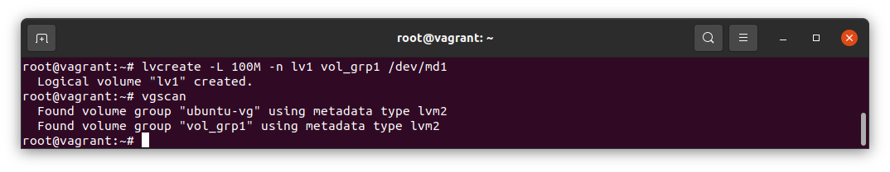  
11. Создайте mkfs.ext4 ФС на получившемся LV.  
Решение: 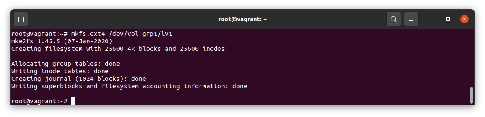  
12. Смонтируйте этот раздел в любую директорию, например, /tmp/new.  
Решение: 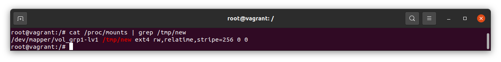  
13. Поместите туда тестовый файл, например wget https://mirror.yandex.ru/ubuntu/ls-lR.gz -O /tmp/new/test.gz.  
Решение: 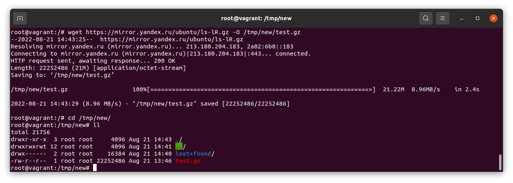  
14. Прикрепите вывод lsblk.  
Решение: 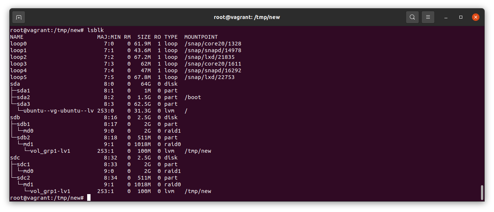  
15. Протестируйте целостность файла  
Решение: 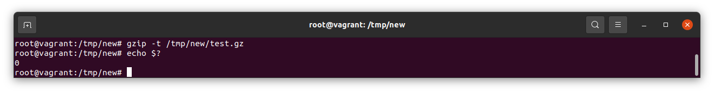  
16. Используя pvmove, переместите содержимое PV с RAID0 на RAID1.  
Решение: 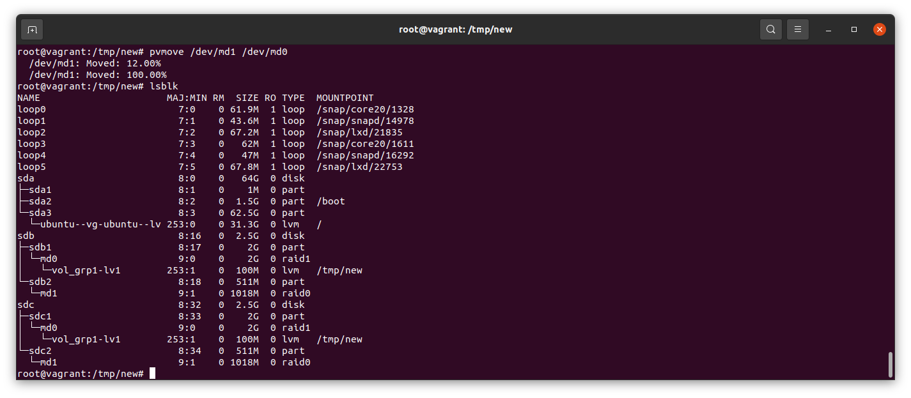  
17. Сделайте --fail на устройство в вашем RAID1 md.  
Решение: 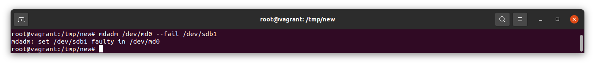  
18. Подтвердите выводом dmesg, что RAID1 работает в деградированном состоянии.  
Решение: 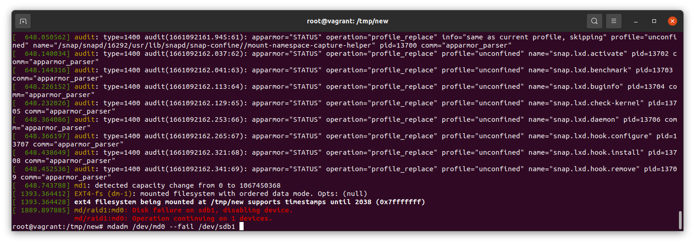  
19. Протестируйте целостность файла, несмотря на "сбойный" диск он должен продолжать быть доступен  
Решение: 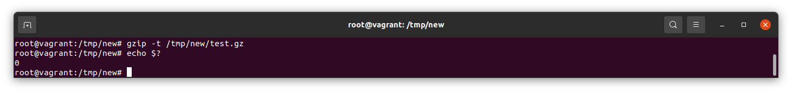  
20. Погасите тестовый хост, vagrant destroy.  
Решение: 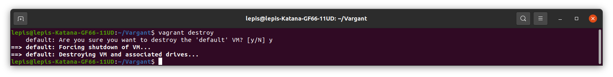