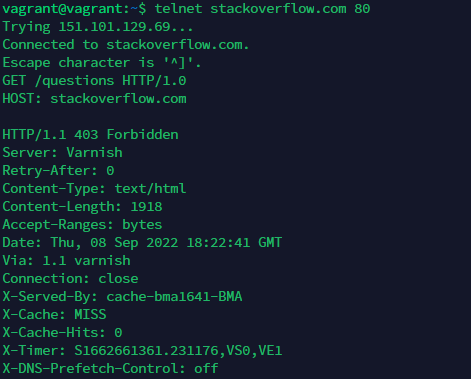
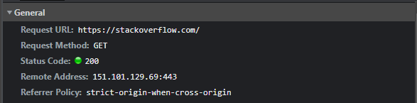
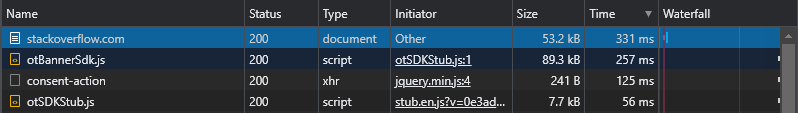
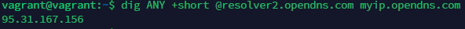
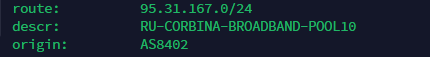
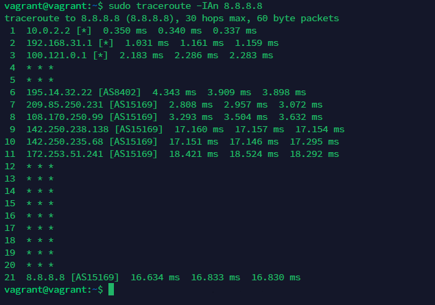
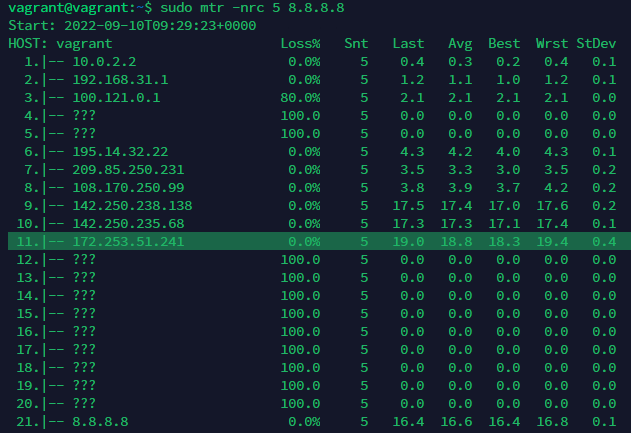
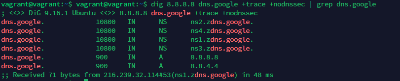
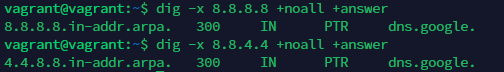

1. Работа c HTTP через телнет.  
* Подключитесь утилитой телнет к сайту stackoverflow.com telnet stackoverflow.com 80  
* отправьте HTTP запрос    
GET /questions HTTP/1.0
HOST: stackoverflow.com  
[press enter]  
[press enter]
* В ответе укажите полученный HTTP код, что он означает?  
Решение:  
  
Ошибка сервера 403 Forbidden означает ограничение или отсутствие доступа к материалу на странице.  
2. Повторите задание 1 в браузере, используя консоль разработчика F12.
* откройте вкладку Network
* отправьте запрос http://stackoverflow.com
* найдите первый ответ HTTP сервера, откройте вкладку Headers
* укажите в ответе полученный HTTP код.
* проверьте время загрузки страницы, какой запрос обрабатывался дольше всего?
* приложите скриншот консоли браузера в ответ.   
Решение:  
  
Ответ получен успешно (200 OK)  
  
Самый долгий ответ 331 ms  
3. Какой IP адрес у вас в интернете?  
Решение:  

4. Какому провайдеру принадлежит ваш IP адрес? Какой автономной системе AS? Воспользуйтесь утилитой whois  
Решение:  

5. Через какие сети проходит пакет, отправленный с вашего компьютера на адрес 8.8.8.8? Через какие AS? Воспользуйтесь утилитой traceroute  
Решение:  

6. Повторите задание 5 в утилите mtr. На каком участке наибольшая задержка - delay?  
Решение:  

7. Какие DNS сервера отвечают за доменное имя dns.google? Какие A записи? воспользуйтесь утилитой dig  
Решение:  

8. Проверьте PTR записи для IP адресов из задания 7. Какое доменное имя привязано к IP? воспользуйтесь утилитой dig  
Решение:  
