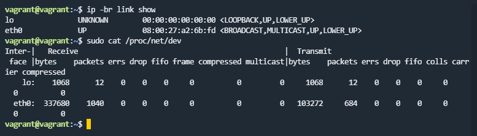
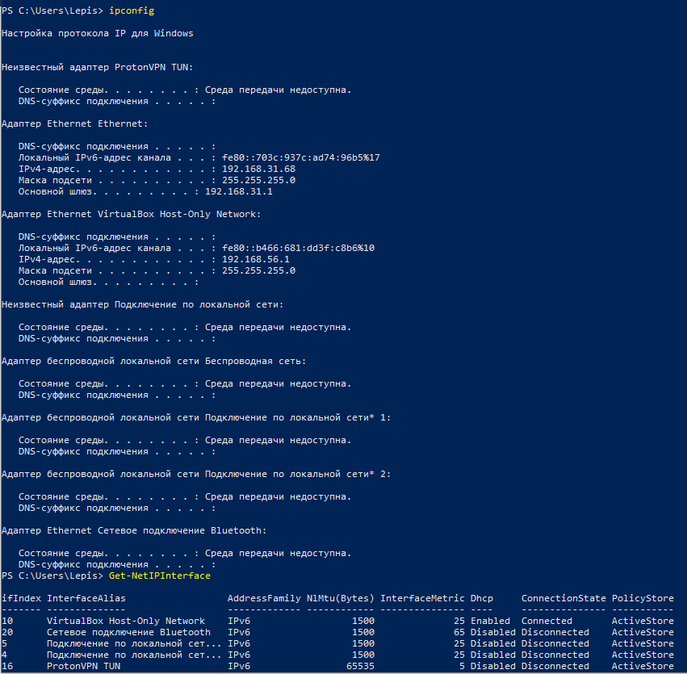
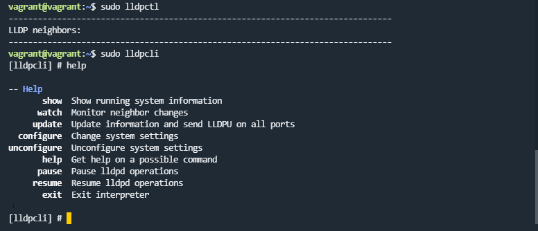
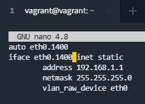
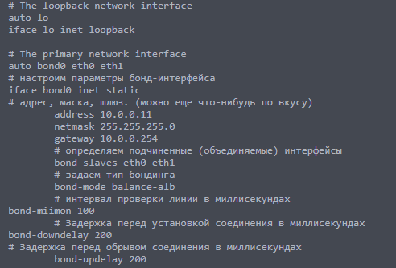
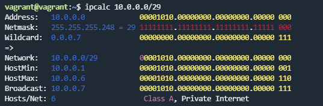
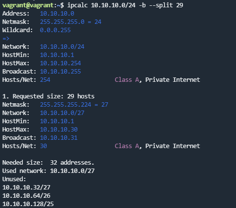
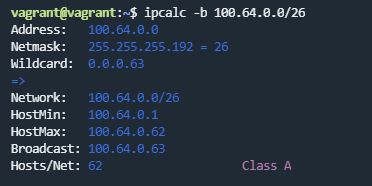
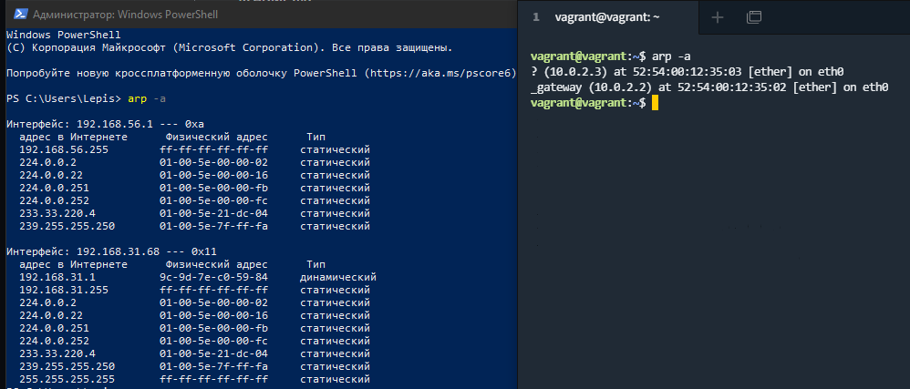

1. Проверьте список доступных сетевых интерфейсов на вашем компьютере. Какие команды есть для этого в Linux и в Windows?  
Решение:  
  
  
2. Какой протокол используется для распознавания соседа по сетевому интерфейсу? Какой пакет и команды есть в Linux для этого?  
Решение:  
Протокол LLDP (Link Layer Discovery Protocol)  

3. Какая технология используется для разделения L2 коммутатора на несколько виртуальных сетей? Какой пакет и команды есть в Linux для этого? Приведите пример конфига.  
Решение: VLAN  
Пример  

4. Какие типы агрегации интерфейсов есть в Linux? Какие опции есть для балансировки нагрузки? Приведите пример конфига.  
Решение:  
```
Mode-0(balance-rr) – Данный режим используется по умолчанию. Balance-rr обеспечивается балансировку нагрузки и отказоустойчивость. В данном режиме сетевые пакеты отправляются “по кругу”, от первого интерфейса к последнему. Если выходят из строя интерфейсы, пакеты отправляются на остальные оставшиеся. Дополнительной настройки коммутатора не требуется при нахождении портов в одном коммутаторе. При разностных коммутаторах требуется дополнительная настройка.  
Mode-1(active-backup) – Один из интерфейсов работает в активном режиме, остальные в ожидающем. При обнаружении проблемы на активном интерфейсе производится переключение на ожидающий интерфейс. Не требуется поддержки от коммутатора.  
Mode-2(balance-xor) – Передача пакетов распределяется по типу входящего и исходящего трафика по формуле ((MAC src) XOR (MAC dest)) % число интерфейсов. Режим дает балансировку нагрузки и отказоустойчивость. Не требуется дополнительной настройки коммутатора/коммутаторов.  
Mode-3(broadcast) – Происходит передача во все объединенные интерфейсы, тем самым обеспечивая отказоустойчивость. Рекомендуется только для использования MULTICAST трафика.  
Mode-4(802.3ad) – динамическое объединение одинаковых портов. В данном режиме можно значительно увеличить пропускную способность входящего так и исходящего трафика. Для данного режима необходима поддержка и настройка коммутатора/коммутаторов.  
Mode-5(balance-tlb) – Адаптивная балансировки нагрузки трафика. Входящий трафик получается только активным интерфейсом, исходящий распределяется в зависимости от текущей загрузки канала каждого интерфейса. Не требуется специальной поддержки и настройки коммутатора/коммутаторов.  
Mode-6(balance-alb) – Адаптивная балансировка нагрузки. Отличается более совершенным алгоритмом балансировки нагрузки чем Mode-5). Обеспечивается балансировку нагрузки как исходящего так и входящего трафика. Не требуется специальной поддержки и настройки коммутатора/коммутаторов.  
```

5. Сколько IP адресов в сети с маской /29 ? Сколько /29 подсетей можно получить из сети с маской /24. Приведите несколько примеров /29 подсетей внутри сети 10.10.10.0/24.  
Решение:  
  
Можно получить 6 IP-адресов, из сети с маской /24 можно получить 32 подсети /29  
  
Примеры /29 подсетей внутри сети 10.10.10.0/24  
6. Задача: вас попросили организовать стык между 2-мя организациями. Диапазоны 10.0.0.0/8, 172.16.0.0/12, 192.168.0.0/16 уже заняты. Из какой подсети допустимо взять частные IP адреса? Маску выберите из расчета максимум 40-50 хостов внутри подсети.  
Решение:  

7. Как проверить ARP таблицу в Linux, Windows? Как очистить ARP кеш полностью? Как из ARP таблицы удалить только один нужный IP?  
Решение: 
  


