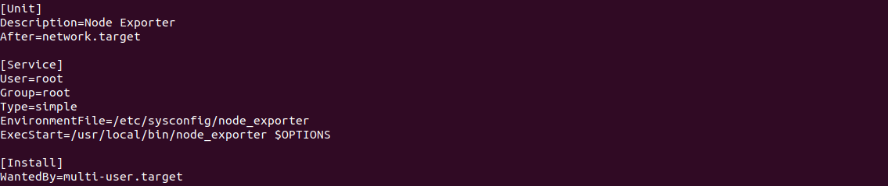
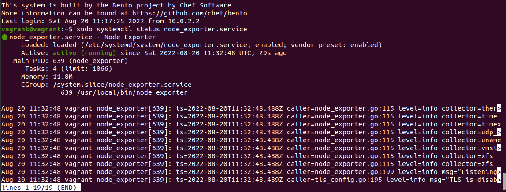
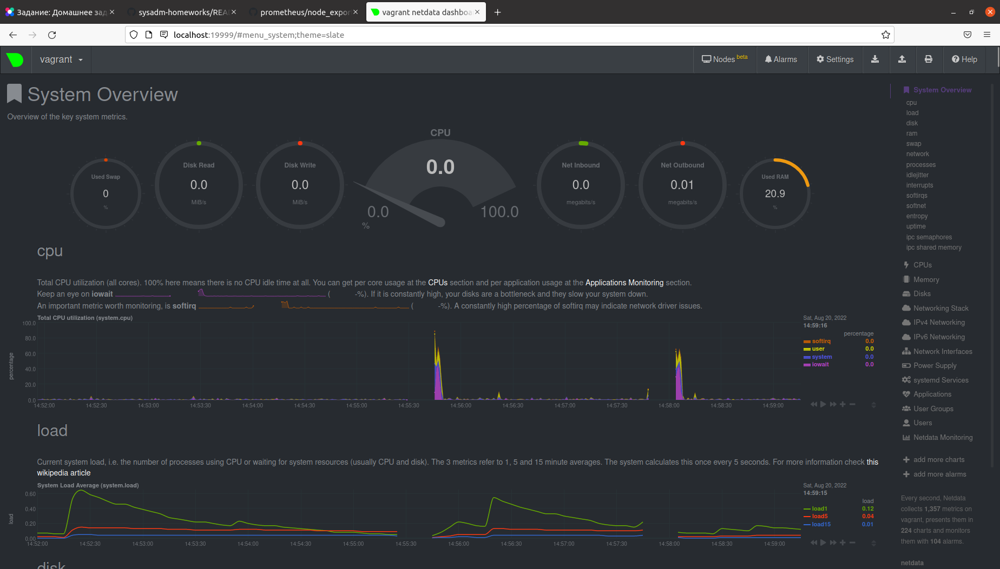
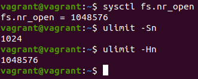
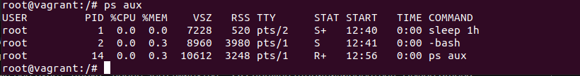

1. На лекции мы познакомились с node_exporter. В демонстрации его исполняемый файл запускался в background. Этого достаточно для демо, но не для настоящей production-системы, где процессы должны находиться под внешним управлением. Используя знания из лекции по systemd, создайте самостоятельно простой unit-файл для node_exporter:  
* поместите его в автозагрузку,  
* предусмотрите возможность добавления опций к запускаемому процессу через внешний файл (посмотрите, например, на systemctl cat cron),  
* удостоверьтесь, что с помощью systemctl процесс корректно стартует, завершается, а после перезагрузки автоматически поднимается.  
Решение: Создан файл node_exporter

Далее командой sudo systemctl enable node_exporter, процесс добавлен в автозагрузку  
После перезапуска машины процесс успешно стартует  

2. Ознакомьтесь с опциями node_exporter и выводом /metrics по-умолчанию. Приведите несколько опций, которые вы бы выбрали для базового мониторинга хоста по CPU, памяти, диску и сети.  
Решение:
--collector.cpu  
--collector.cpufreq  
--collector.meminfo  
--collector.diskstats  
--collector.netstat  
3. Установите в свою виртуальную машину Netdata. Воспользуйтесь готовыми пакетами для установки (sudo apt install -y netdata). После успешной установки:  
* в конфигурационном файле /etc/netdata/netdata.conf в секции [web] замените значение с localhost на bind to = 0.0.0.0,  
* добавьте в Vagrantfile проброс порта Netdata на свой локальный компьютер и сделайте vagrant reload:

config.vm.network "forwarded_port", guest: 19999, host: 19999

После успешной перезагрузки в браузере на своем ПК (не в виртуальной машине) вы должны суметь зайти на localhost:19999. Ознакомьтесь с метриками, которые по умолчанию собираются Netdata и с комментариями, которые даны к этим метрикам.
Решение:  

4. Можно ли по выводу dmesg понять, осознает ли ОС, что загружена не на настоящем оборудовании, а на системе виртуализации?  
Решение: Да  

5.  Как настроен sysctl fs.nr_open на системе по-умолчанию? Узнайте, что означает этот параметр. Какой другой существующий лимит не позволит достичь такого числа (ulimit --help)?  
Решение: 
fs.nr_open = 1048576 - максимальное число открытых дескрипторов  
unlimit -Sn - лимит на пользователя(soft), может быть увеличен  
unlimit -Hn - лимит на пользователя(hard), не может быть увеличен
6. Запустите любой долгоживущий процесс (не ls, который отработает мгновенно, а, например, sleep 1h) в отдельном неймспейсе процессов; покажите, что ваш процесс работает под PID 1 через nsenter. Для простоты работайте в данном задании под root (sudo -i). Под обычным пользователем требуются дополнительные опции (--map-root-user) и т.д.  
Решение:   
7. Найдите информацию о том, что такое :(){ :|:& };:. Запустите эту команду в своей виртуальной машине Vagrant с Ubuntu 20.04 (это важно, поведение в других ОС не проверялось). Некоторое время все будет "плохо", после чего (минуты) – ОС должна стабилизироваться. Вызов dmesg расскажет, какой механизм помог автоматической стабилизации. Как настроен этот механизм по-умолчанию, и как изменить число процессов, которое можно создать в сессии?  
Решение: Как я понял, запускаются два фоновых процесса, каждый из которых вызывает еще два фоновых процесса и тд, пока не закончатся ресурсы тачки.  
Вызов dmesg выдаёт cgroup: fork rejected by pids controller in /user.slice/user-1000.slice/session-6.scope. Данный процесс приводит к стабилизации системы, тоесть не даёт создать больше процессов, которые указаны после вывода команды ulimit -u.

