# Домашнее задание к занятию "6.5. Elasticsearch"

## Задача 1

В этом задании вы потренируетесь в:
- установке elasticsearch
- первоначальном конфигурировании elastcisearch
- запуске elasticsearch в docker

Используя докер образ [centos:7](https://hub.docker.com/_/centos) как базовый и 
[документацию по установке и запуску Elastcisearch](https://www.elastic.co/guide/en/elasticsearch/reference/current/targz.html):

- составьте Dockerfile-манифест для elasticsearch
- соберите docker-образ и сделайте `push` в ваш docker.io репозиторий
- запустите контейнер из получившегося образа и выполните запрос пути `/` c хост-машины

Требования к `elasticsearch.yml`:
- данные `path` должны сохраняться в `/var/lib`
- имя ноды должно быть `netology_test`

В ответе приведите:
- текст Dockerfile манифеста  
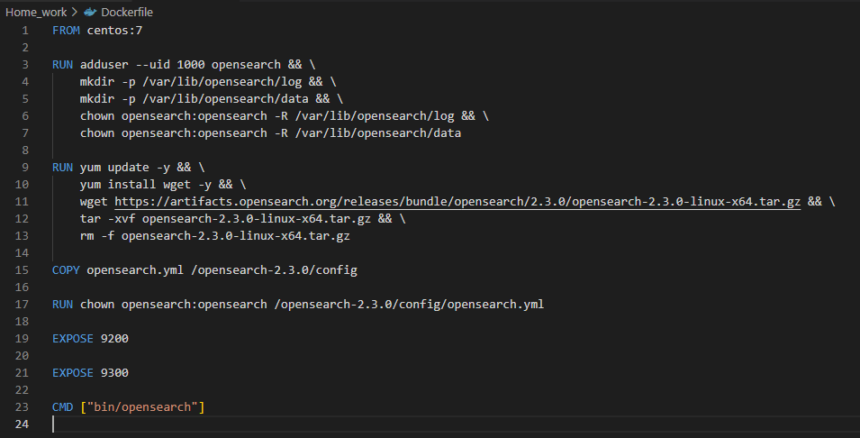  
- ссылку на образ в репозитории dockerhub  
https://hub.docker.com/repository/docker/lepisok/opensearch  
- ответ `elasticsearch` на запрос пути `/` в json виде  
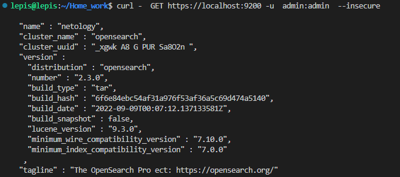  

Подсказки:
- возможно вам понадобится установка пакета perl-Digest-SHA для корректной работы пакета shasum
- при сетевых проблемах внимательно изучите кластерные и сетевые настройки в elasticsearch.yml
- при некоторых проблемах вам поможет docker директива ulimit
- elasticsearch в логах обычно описывает проблему и пути ее решения

Далее мы будем работать с данным экземпляром elasticsearch.

## Задача 2

В этом задании вы научитесь:
- создавать и удалять индексы
- изучать состояние кластера
- обосновывать причину деградации доступности данных

Ознакомтесь с [документацией](https://www.elastic.co/guide/en/elasticsearch/reference/current/indices-create-index.html) 
и добавьте в `elasticsearch` 3 индекса, в соответствии со таблицей:

| Имя | Количество реплик | Количество шард |
|-----|-------------------|-----------------|
| ind-1| 0 | 1 |
| ind-2 | 1 | 2 |
| ind-3 | 2 | 4 |  
```
lepis@lepis:/Home_work$ curl -X PUT localhost:9200/ind-1 -u opensearch -H 'Content-Type: application/json' -d '{"settings":{"number_of_shards": 2,"number_of_replicas": 1}}'  
lepis@lepis:/Home_work$ curl -X PUT localhost:9200/ind-2 -u opensearch -H 'Content-Type: application/json' -d '{"settings":{"number_of_shards": 2,"number_of_replicas": 1}}'   
lepis@lepis:/Home_work$ curl -X PUT localhost:9200/ind-3 -u opensearch -H 'Content-Type: application/json' -d '{"settings":{"number_of_shards": 4,"number_of_replicas": 2}}'  
```
Получите список индексов и их статусов, используя API и **приведите в ответе** на задание.  
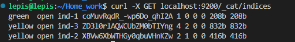  
Получите состояние кластера `elasticsearch`, используя API.  
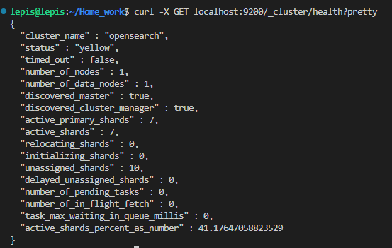  
Как вы думаете, почему часть индексов и кластер находится в состоянии yellow?  
Решение: Так как у нас в кластере 1 нода, а при создании индексов мы указали количество реплик больше 1, поэтому реплицировать индексы некуда  

Удалите все индексы.  
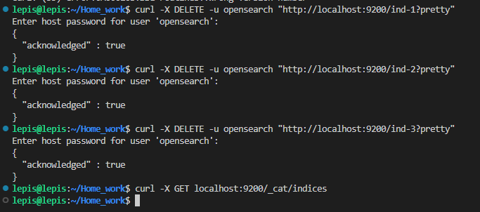  

**Важно**

При проектировании кластера elasticsearch нужно корректно рассчитывать количество реплик и шард,
иначе возможна потеря данных индексов, вплоть до полной, при деградации системы.

## Задача 3

В данном задании вы научитесь:
- создавать бэкапы данных
- восстанавливать индексы из бэкапов

Создайте директорию `{путь до корневой директории с elasticsearch в образе}/snapshots`.  
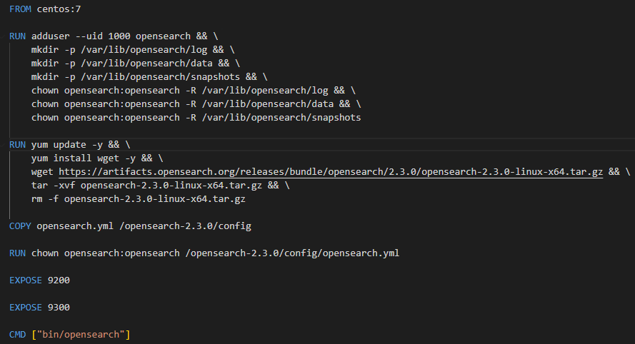  

Используя API [зарегистрируйте](https://www.elastic.co/guide/en/elasticsearch/reference/current/snapshots-register-repository.html#snapshots-register-repository) 
данную директорию как `snapshot repository` c именем `netology_backup`.  

**Приведите в ответе** запрос API и результат вызова API для создания репозитория.  
```
lepis@lepis:~/Home_work$ curl -X PUT localhost:9200/_snapshot/netology_backup -H 'Content-Type: application/json' -d '{"type": "fs", "settings": { "location": "/var/lib/opensearch/snapshots"}}'  
{"acknowledged":true}  
```
Создайте индекс `test` с 0 реплик и 1 шардом и **приведите в ответе** список индексов.  
```
lepis@lepis:~/Home_work$ curl -X PUT localhost:9200/test -H 'Content-Type: application/json' -d '{"settings": {"number_of_shards": 1, "number_of_replicas": 0}}'  
{"acknowledged":true,"shards_acknowledged":true,"index":"test"}  
```
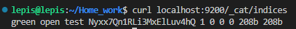  

[Создайте `snapshot`](https://www.elastic.co/guide/en/elasticsearch/reference/current/snapshots-take-snapshot.html) 
состояния кластера `elasticsearch`. 

**Приведите в ответе** список файлов в директории со `snapshot`ами.  
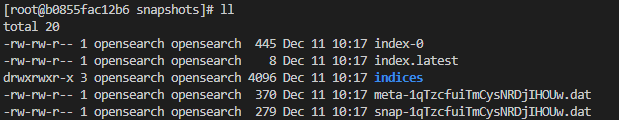  

Удалите индекс `test` и создайте индекс `test-2`. **Приведите в ответе** список индексов.  
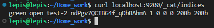  

[Восстановите](https://www.elastic.co/guide/en/elasticsearch/reference/current/snapshots-restore-snapshot.html) состояние
кластера `elasticsearch` из `snapshot`, созданного ранее.  
**Приведите в ответе** запрос к API восстановления и итоговый список индексов.  
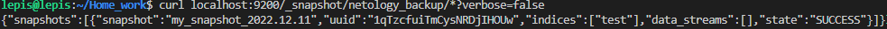  
  
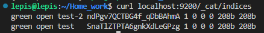  
---
