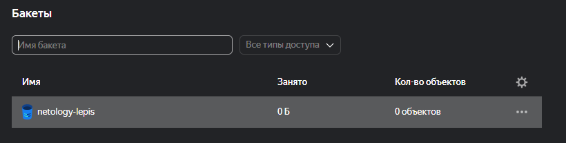

# Домашнее задание к занятию "7.3. Основы и принцип работы Терраформ"

## Задача 1. Создадим бэкэнд в S3 (необязательно, но крайне желательно).

Если в рамках предыдущего задания у вас уже есть аккаунт AWS, то давайте продолжим знакомство со взаимодействием
терраформа и aws. 

1. Создайте s3 бакет, iam роль и пользователя от которого будет работать терраформ. Можно создать отдельного пользователя,
а можно использовать созданного в рамках предыдущего задания, просто добавьте ему необходимы права, как описано 
[здесь](https://www.terraform.io/docs/backends/types/s3.html).
1. Зарегистрируйте бэкэнд в терраформ проекте как описано по ссылке выше.  

Решение: Бэкэнд создан  
  

## Задача 2. Инициализируем проект и создаем воркспейсы. 

1. Выполните `terraform init`:
    * если был создан бэкэнд в S3, то терраформ создат файл стейтов в S3 и запись в таблице 
dynamodb.
    * иначе будет создан локальный файл со стейтами.  
1. Создайте два воркспейса `stage` и `prod`.
1. В уже созданный `aws_instance` добавьте зависимость типа инстанса от вокспейса, что бы в разных ворскспейсах 
использовались разные `instance_type`.
1. Добавим `count`. Для `stage` должен создаться один экземпляр `ec2`, а для `prod` два. 
1. Создайте рядом еще один `aws_instance`, но теперь определите их количество при помощи `for_each`, а не `count`.
1. Что бы при изменении типа инстанса не возникло ситуации, когда не будет ни одного инстанса добавьте параметр
жизненного цикла `create_before_destroy = true` в один из рессурсов `aws_instance`.
1. При желании поэкспериментируйте с другими параметрами и рессурсами.

В виде результата работы пришлите:
* Вывод команды `terraform workspace list`.  
```
root@lepis:/home/lepis/home_terraform# terraform workspace list
  default
* prod
  stage
```  
* Вывод команды `terraform plan` для воркспейса `prod`.  
```
Terraform used the selected providers to generate the following execution plan. Resource actions are indicated with
the following symbols:
  + create

Terraform will perform the following actions:

  # yandex_compute_instance.centos-count[0] will be created
  + resource "yandex_compute_instance" "centos-count" {
      + created_at                = (known after apply)
      + folder_id                 = (known after apply)
      + fqdn                      = (known after apply)
      + hostname                  = (known after apply)
      + id                        = (known after apply)
      + name                      = "prod-count-0"
      + network_acceleration_type = "standard"
      + platform_id               = "standard-v1"
      + service_account_id        = (known after apply)
      + status                    = (known after apply)
      + zone                      = (known after apply)

      + boot_disk {
          + auto_delete = true
          + device_name = (known after apply)
          + disk_id     = (known after apply)
          + mode        = (known after apply)

          + initialize_params {
              + block_size  = (known after apply)
              + description = (known after apply)
              + image_id    = "fd8jvcoeij6u9se84dt5"
              + name        = (known after apply)
              + size        = 40
              + snapshot_id = (known after apply)
              + type        = "network-nvme"
            }
        }

      + metadata_options {
          + aws_v1_http_endpoint = (known after apply)
          + aws_v1_http_token    = (known after apply)
          + gce_http_endpoint    = (known after apply)
          + gce_http_token       = (known after apply)
        }

      + network_interface {
          + index              = (known after apply)
          + ip_address         = (known after apply)
          + ipv4               = true
          + ipv6               = (known after apply)
          + ipv6_address       = (known after apply)
          + mac_address        = (known after apply)
          + nat                = true
          + nat_ip_address     = (known after apply)
          + nat_ip_version     = (known after apply)
          + security_group_ids = (known after apply)
          + subnet_id          = (known after apply)
        }

      + placement_policy {
          + host_affinity_rules = (known after apply)
          + placement_group_id  = (known after apply)
        }

      + resources {
          + core_fraction = 100
          + cores         = 2
          + memory        = 2
        }

      + scheduling_policy {
          + preemptible = (known after apply)
        }
    }

  # yandex_compute_instance.centos-count[1] will be created
  + resource "yandex_compute_instance" "centos-count" {
      + created_at                = (known after apply)
      + folder_id                 = (known after apply)
      + fqdn                      = (known after apply)
      + hostname                  = (known after apply)
      + id                        = (known after apply)
      + name                      = "prod-count-1"
      + network_acceleration_type = "standard"
      + platform_id               = "standard-v1"
      + service_account_id        = (known after apply)
      + status                    = (known after apply)
      + zone                      = (known after apply)

      + boot_disk {
          + auto_delete = true
          + device_name = (known after apply)
          + disk_id     = (known after apply)
          + mode        = (known after apply)

          + initialize_params {
              + block_size  = (known after apply)
              + description = (known after apply)
              + image_id    = "fd8jvcoeij6u9se84dt5"
              + name        = (known after apply)
              + size        = 40
              + snapshot_id = (known after apply)
              + type        = "network-nvme"
            }
        }

      + metadata_options {
          + aws_v1_http_endpoint = (known after apply)
          + aws_v1_http_token    = (known after apply)
          + gce_http_endpoint    = (known after apply)
          + gce_http_token       = (known after apply)
        }

      + network_interface {
          + index              = (known after apply)
          + ip_address         = (known after apply)
          + ipv4               = true
          + ipv6               = (known after apply)
          + ipv6_address       = (known after apply)
          + mac_address        = (known after apply)
          + nat                = true
          + nat_ip_address     = (known after apply)
          + nat_ip_version     = (known after apply)
          + security_group_ids = (known after apply)
          + subnet_id          = (known after apply)
        }

      + placement_policy {
          + host_affinity_rules = (known after apply)
          + placement_group_id  = (known after apply)
        }

      + resources {
          + core_fraction = 100
          + cores         = 2
          + memory        = 2
        }

      + scheduling_policy {
          + preemptible = (known after apply)
        }
    }

  # yandex_compute_instance.centos-for-each["1"] will be created
  + resource "yandex_compute_instance" "centos-for-each" {
      + created_at                = (known after apply)
      + folder_id                 = (known after apply)
      + fqdn                      = (known after apply)
      + hostname                  = (known after apply)
      + id                        = (known after apply)
      + name                      = "prod-foreach-1"
      + network_acceleration_type = "standard"
      + platform_id               = "standard-v1"
      + service_account_id        = (known after apply)
      + status                    = (known after apply)
      + zone                      = (known after apply)

      + boot_disk {
          + auto_delete = true
          + device_name = (known after apply)
          + disk_id     = (known after apply)
          + mode        = (known after apply)

          + initialize_params {
              + block_size  = (known after apply)
              + description = (known after apply)
              + image_id    = "fd8jvcoeij6u9se84dt5"
              + name        = (known after apply)
              + size        = 40
              + snapshot_id = (known after apply)
              + type        = "network-nvme"
            }
        }

      + metadata_options {
          + aws_v1_http_endpoint = (known after apply)
          + aws_v1_http_token    = (known after apply)
          + gce_http_endpoint    = (known after apply)
          + gce_http_token       = (known after apply)
        }

      + network_interface {
          + index              = (known after apply)
          + ip_address         = (known after apply)
          + ipv4               = true
          + ipv6               = (known after apply)
          + ipv6_address       = (known after apply)
          + mac_address        = (known after apply)
          + nat                = true
          + nat_ip_address     = (known after apply)
          + nat_ip_version     = (known after apply)
          + security_group_ids = (known after apply)
          + subnet_id          = (known after apply)
        }

      + placement_policy {
          + host_affinity_rules = (known after apply)
          + placement_group_id  = (known after apply)
        }

      + resources {
          + core_fraction = 100
          + cores         = 2
          + memory        = 2
        }

      + scheduling_policy {
          + preemptible = (known after apply)
        }
    }

  # yandex_compute_instance.centos-for-each["2"] will be created
  + resource "yandex_compute_instance" "centos-for-each" {
      + created_at                = (known after apply)
      + folder_id                 = (known after apply)
      + fqdn                      = (known after apply)
      + hostname                  = (known after apply)
      + id                        = (known after apply)
      + name                      = "prod-foreach-2"
      + network_acceleration_type = "standard"
      + platform_id               = "standard-v1"
      + service_account_id        = (known after apply)
      + status                    = (known after apply)
      + zone                      = (known after apply)

      + boot_disk {
          + auto_delete = true
          + device_name = (known after apply)
          + disk_id     = (known after apply)
          + mode        = (known after apply)

          + initialize_params {
              + block_size  = (known after apply)
              + description = (known after apply)
              + image_id    = "fd8jvcoeij6u9se84dt5"
              + name        = (known after apply)
              + size        = 40
              + snapshot_id = (known after apply)
              + type        = "network-nvme"
            }
        }

      + metadata_options {
          + aws_v1_http_endpoint = (known after apply)
          + aws_v1_http_token    = (known after apply)
          + gce_http_endpoint    = (known after apply)
          + gce_http_token       = (known after apply)
        }

      + network_interface {
          + index              = (known after apply)
          + ip_address         = (known after apply)
          + ipv4               = true
          + ipv6               = (known after apply)
          + ipv6_address       = (known after apply)
          + mac_address        = (known after apply)
          + nat                = true
          + nat_ip_address     = (known after apply)
          + nat_ip_version     = (known after apply)
          + security_group_ids = (known after apply)
          + subnet_id          = (known after apply)
        }

      + placement_policy {
          + host_affinity_rules = (known after apply)
          + placement_group_id  = (known after apply)
        }

      + resources {
          + core_fraction = 100
          + cores         = 2
          + memory        = 2
        }

      + scheduling_policy {
          + preemptible = (known after apply)
        }
    }

  # yandex_iam_service_account.sa will be created
  + resource "yandex_iam_service_account" "sa" {
      + created_at = (known after apply)
      + folder_id  = (known after apply)
      + id         = (known after apply)
      + name       = "lepis"
    }

  # yandex_iam_service_account_static_access_key.sa-static-key will be created
  + resource "yandex_iam_service_account_static_access_key" "sa-static-key" {
      + access_key           = (known after apply)
      + created_at           = (known after apply)
      + description          = "static access key for object storage"
      + encrypted_secret_key = (known after apply)
      + id                   = (known after apply)
      + key_fingerprint      = (known after apply)
      + secret_key           = (sensitive value)
      + service_account_id   = (known after apply)
    }

  # yandex_resourcemanager_folder_iam_member.sa-editor will be created
  + resource "yandex_resourcemanager_folder_iam_member" "sa-editor" {
      + folder_id = "b1g1k64h2f89q85s1fv9"
      + id        = (known after apply)
      + member    = (known after apply)
      + role      = "storage.editor"
    }

  # yandex_storage_bucket.netology-lepis will be created
  + resource "yandex_storage_bucket" "netology-lepis" {
      + access_key            = (known after apply)
      + acl                   = "private"
      + bucket                = "netology-lepis"
      + bucket_domain_name    = (known after apply)
      + default_storage_class = (known after apply)
      + folder_id             = (known after apply)
      + force_destroy         = false
      + id                    = (known after apply)
      + secret_key            = (sensitive value)
      + website_domain        = (known after apply)
      + website_endpoint      = (known after apply)

      + anonymous_access_flags {
          + list = (known after apply)
          + read = (known after apply)
        }

      + versioning {
          + enabled = (known after apply)
        }
    }

  # yandex_vpc_network.network-1 will be created
  + resource "yandex_vpc_network" "network-1" {
      + created_at                = (known after apply)
      + default_security_group_id = (known after apply)
      + folder_id                 = (known after apply)
      + id                        = (known after apply)
      + labels                    = (known after apply)
      + name                      = "network_a"
      + subnet_ids                = (known after apply)
    }

  # yandex_vpc_subnet.subnet-1 will be created
  + resource "yandex_vpc_subnet" "subnet-1" {
      + created_at     = (known after apply)
      + folder_id      = (known after apply)
      + id             = (known after apply)
      + labels         = (known after apply)
      + name           = "subnet"
      + network_id     = (known after apply)
      + v4_cidr_blocks = [
          + "192.168.10.0/24",
        ]
      + v6_cidr_blocks = (known after apply)
      + zone           = "ru-central1-a"
    }

Plan: 10 to add, 0 to change, 0 to destroy.

Changes to Outputs:
  + external_ip_address_vm_1 = [
      + (known after apply),
      + (known after apply),
    ]
  + internal_ip_address_vm_1 = [
      + (known after apply),
      + (known after apply),
    ]

──────────────────────────────────────────────────────────────────────────────────────────────────────────────────────

Note: You didn't use the -out option to save this plan, so Terraform can't guarantee to take exactly these actions if
you run "terraform apply" now.
```

---
