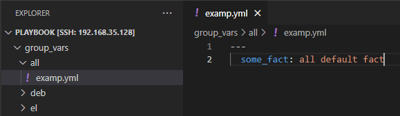
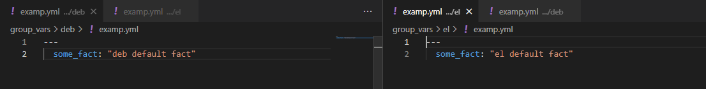

# Домашнее задание к занятию "1. Введение в Ansible"

## Подготовка к выполнению
1. Установите ansible версии 2.10 или выше.
2. Создайте свой собственный публичный репозиторий на github с произвольным именем.
3. Скачайте [playbook](./playbook/) из репозитория с домашним заданием и перенесите его в свой репозиторий.

## Основная часть
1. Попробуйте запустить playbook на окружении из `test.yml`, зафиксируйте какое значение имеет факт `some_fact` для указанного хоста при выполнении playbook'a.  
Решение:  
```
lepis@lepis:~/Downloads/mnt-homeworks-MNT-video/08-ansible-01-base/playbook$ ansible-playbook -i inventory/test.yml site.yml

PLAY [Print os facts] ***********************************************************************************************************************************

TASK [Gathering Facts] **********************************************************************************************************************************
ok: [localhost]

TASK [Print OS] *****************************************************************************************************************************************
ok: [localhost] => {
    "msg": "Ubuntu"
}

TASK [Print fact] ***************************************************************************************************************************************
ok: [localhost] => {
    "msg": 12
}

PLAY RECAP **********************************************************************************************************************************************
localhost                  : ok=3    changed=0    unreachable=0    failed=0    skipped=0    rescued=0    ignored=0 
```
2. Найдите файл с переменными (group_vars) в котором задаётся найденное в первом пункте значение и поменяйте его на 'all default fact'.  
Решение:  

3. Воспользуйтесь подготовленным (используется `docker`) или создайте собственное окружение для проведения дальнейших испытаний.  
Решение:  [docker-compose.yml](https://github.com/Lepisok/devops-netology/blob/main/3_CI%2C%20monitoring%20and%20settings%20management/08-ansible-01-base/src/docker-compose.yml)  
4. Проведите запуск playbook на окружении из `prod.yml`. Зафиксируйте полученные значения `some_fact` для каждого из `managed host`.  
Решение:  
```
lepis@lepis:~/Downloads/mnt-homeworks-MNT-video/08-ansible-01-base/playbook$ sudo ansible-playbook -i inventory/prod.yml site.yml

PLAY [Print os facts] ***********************************************************************************************************************************

TASK [Gathering Facts] **********************************************************************************************************************************
[DEPRECATION WARNING]: Distribution ubuntu 20.04 on host ubuntu should use /usr/bin/python3, but is using /usr/bin/python for backward compatibility 
with prior Ansible releases. A future Ansible release will default to using the discovered platform python for this host. See 
https://docs.ansible.com/ansible/2.10/reference_appendices/interpreter_discovery.html for more information. This feature will be removed in version 
2.12. Deprecation warnings can be disabled by setting deprecation_warnings=False in ansible.cfg.
ok: [ubuntu]
ok: [centos7]

TASK [Print OS] *****************************************************************************************************************************************
ok: [centos7] => {
    "msg": "CentOS"
}
ok: [ubuntu] => {
    "msg": "Ubuntu"
}

TASK [Print fact] ***************************************************************************************************************************************
ok: [centos7] => {
    "msg": "el"
}
ok: [ubuntu] => {
    "msg": "deb"
}

PLAY RECAP **********************************************************************************************************************************************
centos7                    : ok=3    changed=0    unreachable=0    failed=0    skipped=0    rescued=0    ignored=0   
ubuntu                     : ok=3    changed=0    unreachable=0    failed=0    skipped=0    rescued=0    ignored=0                      : ok=3    changed=0    unreachable=0    failed=0    skipped=0    rescued=0    ignored=0   
```
5. Добавьте факты в `group_vars` каждой из групп хостов так, чтобы для `some_fact` получились следующие значения: для `deb` - 'deb default fact', для `el` - 'el default fact'.  
Решение:    
6.  Повторите запуск playbook на окружении `prod.yml`. Убедитесь, что выдаются корректные значения для всех хостов.  
Решение:  
```
lepis@lepis:~/Downloads/mnt-homeworks-MNT-video/08-ansible-01-base/playbook$ sudo ansible-playbook -i inventory/prod.yml site.yml

PLAY [Print os facts] ***********************************************************************************************************************************

TASK [Gathering Facts] **********************************************************************************************************************************
[DEPRECATION WARNING]: Distribution ubuntu 20.04 on host ubuntu should use /usr/bin/python3, but is using /usr/bin/python for backward compatibility 
with prior Ansible releases. A future Ansible release will default to using the discovered platform python for this host. See 
https://docs.ansible.com/ansible/2.10/reference_appendices/interpreter_discovery.html for more information. This feature will be removed in version 
2.12. Deprecation warnings can be disabled by setting deprecation_warnings=False in ansible.cfg.
ok: [ubuntu]
ok: [centos7]

TASK [Print OS] *****************************************************************************************************************************************
ok: [centos7] => {
    "msg": "CentOS"
}
ok: [ubuntu] => {
    "msg": "Ubuntu"
}

TASK [Print fact] ***************************************************************************************************************************************
ok: [centos7] => {
    "msg": "el default fact"
}
ok: [ubuntu] => {
    "msg": "deb default fact"
}

PLAY RECAP **********************************************************************************************************************************************
centos7                    : ok=3    changed=0    unreachable=0    failed=0    skipped=0    rescued=0    ignored=0   
ubuntu                     : ok=3    changed=0    unreachable=0    failed=0    skipped=0    rescued=0    ignored=0 
```  
7. При помощи `ansible-vault` зашифруйте факты в `group_vars/deb` и `group_vars/el` с паролем `netology`.  
Решение:  
```
lepis@lepis:~/Downloads/mnt-homeworks-MNT-video/08-ansible-01-base/playbook$ ansible-vault encrypt group_vars/el/examp.yml
New Vault password: 
Confirm New Vault password: 
Encryption successful
lepis@lepis:~/Downloads/mnt-homeworks-MNT-video/08-ansible-01-base/playbook$ ansible-vault encrypt group_vars/deb/examp.yml 
New Vault password: 
Confirm New Vault password: 
Encryption successful
```
8. Запустите playbook на окружении `prod.yml`. При запуске `ansible` должен запросить у вас пароль. Убедитесь в работоспособности.
Решение:  
```
lepis@lepis:~/Downloads/mnt-homeworks-MNT-video/08-ansible-01-base/playbook$ sudo ansible-playbook -i inventory/prod.yml --ask-vault-pass site.yml 
Vault password: 

PLAY [Print os facts] ******************************************************************************************************************************************************************************************

TASK [Gathering Facts] *****************************************************************************************************************************************************************************************
[DEPRECATION WARNING]: Distribution ubuntu 20.04 on host ubuntu should use /usr/bin/python3, but is using /usr/bin/python for backward compatibility with prior Ansible releases. A future Ansible release will
 default to using the discovered platform python for this host. See https://docs.ansible.com/ansible/2.10/reference_appendices/interpreter_discovery.html for more information. This feature will be removed in
 version 2.12. Deprecation warnings can be disabled by setting deprecation_warnings=False in ansible.cfg.
ok: [ubuntu]
ok: [centos7]

TASK [Print OS] ************************************************************************************************************************************************************************************************
ok: [centos7] => {
    "msg": "CentOS"
}
ok: [ubuntu] => {
    "msg": "Ubuntu"
}

TASK [Print fact] **********************************************************************************************************************************************************************************************
ok: [centos7] => {
    "msg": "el default fact"
}
ok: [ubuntu] => {
    "msg": "deb default fact"
}

PLAY RECAP *****************************************************************************************************************************************************************************************************
centos7                    : ok=3    changed=0    unreachable=0    failed=0    skipped=0    rescued=0    ignored=0   
ubuntu                     : ok=3    changed=0    unreachable=0    failed=0    skipped=0    rescued=0    ignored=0   
```
9. Посмотрите при помощи `ansible-doc` список плагинов для подключения. Выберите подходящий для работы на `control node`.  
Решение:  
```
lepis@lepis:~/Downloads/mnt-homeworks-MNT-video/08-ansible-01-base/playbook$ ansible-doc -t connection ansible.builtin.local
> ANSIBLE.BUILTIN.LOCAL    (/home/lepis/.local/lib/python3.10/site-packages/ansible/plugins/connection/local.py)

        This connection plugin allows ansible to execute tasks on the Ansible 'controller' instead of on a remote host.

ADDED IN: historical

OPTIONS (= is mandatory):

- pipelining
        Pipelining reduces the number of connection operations required to execute a module on the remote server, by executing many Ansible modules without actual
        file transfers.
        This can result in a very significant performance improvement when enabled.
        However this can conflict with privilege escalation (become). For example, when using sudo operations you must first disable 'requiretty' in the sudoers file
        for the target hosts, which is why this feature is disabled by default.
        set_via:
          env:
          - name: ANSIBLE_PIPELINING
          ini:
          - key: pipelining
            section: defaults
          - key: pipelining
            section: connection
```
10. В `prod.yml` добавьте новую группу хостов с именем  `local`, в ней разместите localhost с необходимым типом подключения.  
Решение:  
```
  el:
    hosts:
      centos7:
        ansible_connection: docker
  deb:
    hosts:
      ubuntu:
        ansible_connection: docker
  local:
    host:
      local_host:
        ansible_connection: local
```
11. Запустите playbook на окружении `prod.yml`. При запуске `ansible` должен запросить у вас пароль. Убедитесь что факты `some_fact` для каждого из хостов определены из верных `group_vars`.  
Решение:  
```
epis@lepis:~/Downloads/mnt-homeworks-MNT-video/08-ansible-01-base/playbook$ sudo ansible-playbook -i inventory/prod.yml --ask-vault-pass site.yml
Vault password: 

PLAY [Print os facts] ******************************************************************************************************************************************************************************************

TASK [Gathering Facts] *****************************************************************************************************************************************************************************************
ok: [local_host]
[DEPRECATION WARNING]: Distribution ubuntu 20.04 on host ubuntu should use /usr/bin/python3, but is using /usr/bin/python for backward compatibility with prior Ansible releases. A future Ansible release will
 default to using the discovered platform python for this host. See https://docs.ansible.com/ansible/2.10/reference_appendices/interpreter_discovery.html for more information. This feature will be removed in
 version 2.12. Deprecation warnings can be disabled by setting deprecation_warnings=False in ansible.cfg.
ok: [ubuntu]
ok: [centos7]

TASK [Print OS] ************************************************************************************************************************************************************************************************
ok: [local_host] => {
    "msg": "Ubuntu"
}
ok: [centos7] => {
    "msg": "CentOS"
}
ok: [ubuntu] => {
    "msg": "Ubuntu"
}

TASK [Print fact] **********************************************************************************************************************************************************************************************
ok: [local_host] => {
    "msg": "all default fact"
}
ok: [centos7] => {
    "msg": "el default fact"
}
ok: [ubuntu] => {
    "msg": "deb default fact"
}

PLAY RECAP *****************************************************************************************************************************************************************************************************
centos7                    : ok=3    changed=0    unreachable=0    failed=0    skipped=0    rescued=0    ignored=0   
local_host                 : ok=3    changed=0    unreachable=0    failed=0    skipped=0    rescued=0    ignored=0   
ubuntu                     : ok=3    changed=0    unreachable=0    failed=0    skipped=0    rescued=0    ignored=0   
```
12. Заполните `README.md` ответами на вопросы. Сделайте `git push` в ветку `master`. В ответе отправьте ссылку на ваш открытый репозиторий с изменённым `playbook` и заполненным `README.md`.

## Необязательная часть

1. При помощи `ansible-vault` расшифруйте все зашифрованные файлы с переменными.  
Решение:  
```
lepis@lepis:~/Downloads/mnt-homeworks-MNT-video/08-ansible-01-base/playbook$ ansible-vault decrypt group_vars/deb/examp.yml 
Vault password: 
Decryption successful
lepis@lepis:~/Downloads/mnt-homeworks-MNT-video/08-ansible-01-base/playbook$ ansible-vault decrypt group_vars/el/examp.yml 
Vault password: 
Decryption successful
```
2. Зашифруйте отдельное значение `PaSSw0rd` для переменной `some_fact` паролем `netology`. Добавьте полученное значение в `group_vars/all/exmp.yml`.  
Решение:  
```
lepis@lepis:~/Downloads/mnt-homeworks-MNT-video/08-ansible-01-base/playbook$ ansible-vault encrypt_string
New Vault password: 
Confirm New Vault password: 
Reading plaintext input from stdin. (ctrl-d to end input, twice if your content does not already have a newline)
PaSSw0rd
Encryption successful
!vault |
          $ANSIBLE_VAULT;1.1;AES256
          35353562306630656631383438643231383265323237663035663833666535393933666136363865
          3733643137366662356130653439383437636666643032350a356437613762393161636331383766
          33663434386539393930633939346138646237666663356137333836366135356531646339663536
          3538386261373833330a346162323666366335646264366566363533383334306131383437663163
          3339
```
3. Запустите `playbook`, убедитесь, что для нужных хостов применился новый `fact`.
Решение:  
```
lepis@lepis:~/Downloads/mnt-homeworks-MNT-video/08-ansible-01-base/playbook$ sudo ansible-playbook -i inventory/prod.yml --ask-vault-pass site.yml 
Vault password: 

PLAY [Print os facts] ******************************************************************************************************************************************************************************************

TASK [Gathering Facts] *****************************************************************************************************************************************************************************************
ok: [local_host]
[DEPRECATION WARNING]: Distribution ubuntu 20.04 on host ubuntu should use /usr/bin/python3, but is using /usr/bin/python for backward compatibility with prior Ansible releases. A future Ansible release will
 default to using the discovered platform python for this host. See https://docs.ansible.com/ansible/2.10/reference_appendices/interpreter_discovery.html for more information. This feature will be removed in
 version 2.12. Deprecation warnings can be disabled by setting deprecation_warnings=False in ansible.cfg.
ok: [ubuntu]
ok: [centos7]

TASK [Print OS] ************************************************************************************************************************************************************************************************
ok: [local_host] => {
    "msg": "Ubuntu"
}
ok: [centos7] => {
    "msg": "CentOS"
}
ok: [ubuntu] => {
    "msg": "Ubuntu"
}

TASK [Print fact] **********************************************************************************************************************************************************************************************
ok: [local_host] => {
    "msg": "PaSSw0rd"
}
ok: [centos7] => {
    "msg": "el default fact"
}
ok: [ubuntu] => {
    "msg": "deb default fact"
}

PLAY RECAP *****************************************************************************************************************************************************************************************************
centos7                    : ok=3    changed=0    unreachable=0    failed=0    skipped=0    rescued=0    ignored=0   
local_host                 : ok=3    changed=0    unreachable=0    failed=0    skipped=0    rescued=0    ignored=0   
ubuntu                     : ok=3    changed=0    unreachable=0    failed=0    skipped=0    rescued=0    ignored=0   
```
4. Добавьте новую группу хостов `fedora`, самостоятельно придумайте для неё переменную. В качестве образа можно использовать [этот](https://hub.docker.com/r/pycontribs/fedora).
Решение:  
```
lepis@lepis:~/Downloads/mnt-homeworks-MNT-video/08-ansible-01-base/playbook$ sudo ansible-playbook -i inventory/prod.yml --ask-vault-pass site.yml
Vault password: 

PLAY [Print os facts] ******************************************************************************************************************************************************************************************

TASK [Gathering Facts] *****************************************************************************************************************************************************************************************
ok: [local_host]
[DEPRECATION WARNING]: Distribution ubuntu 20.04 on host ubuntu should use /usr/bin/python3, but is using /usr/bin/python for backward compatibility with prior Ansible releases. A future Ansible release will
 default to using the discovered platform python for this host. See https://docs.ansible.com/ansible/2.10/reference_appendices/interpreter_discovery.html for more information. This feature will be removed in
 version 2.12. Deprecation warnings can be disabled by setting deprecation_warnings=False in ansible.cfg.
ok: [ubuntu]
ok: [fedora]
ok: [centos7]

TASK [Print OS] ************************************************************************************************************************************************************************************************
ok: [local_host] => {
    "msg": "Ubuntu"
}
ok: [centos7] => {
    "msg": "CentOS"
}
ok: [ubuntu] => {
    "msg": "Ubuntu"
}
ok: [fedora] => {
    "msg": "Fedora"
}

TASK [Print fact] **********************************************************************************************************************************************************************************************
ok: [local_host] => {
    "msg": "PaSSw0rd"
}
ok: [centos7] => {
    "msg": "el default fact"
}
ok: [ubuntu] => {
    "msg": "deb default fact"
}
ok: [fedora] => {
    "msg": "fed default fact"
}

PLAY RECAP *****************************************************************************************************************************************************************************************************
centos7                    : ok=3    changed=0    unreachable=0    failed=0    skipped=0    rescued=0    ignored=0   
fedora                     : ok=3    changed=0    unreachable=0    failed=0    skipped=0    rescued=0    ignored=0   
local_host                 : ok=3    changed=0    unreachable=0    failed=0    skipped=0    rescued=0    ignored=0   
ubuntu                     : ok=3    changed=0    unreachable=0    failed=0    skipped=0    rescued=0    ignored=0   
```
5. Напишите скрипт на bash: автоматизируйте поднятие необходимых контейнеров, запуск ansible-playbook и остановку контейнеров.
```
lepis@lepis:~/Downloads/mnt-homeworks-MNT-video/08-ansible-01-base/playbook$ sudo ./script.sh
centos7 is up-to-date
ubuntu is up-to-date
fedora is up-to-date
Vault password: 

PLAY [Print os facts] ******************************************************************************************************************************************************************************************

TASK [Gathering Facts] *****************************************************************************************************************************************************************************************
ok: [local_host]
[DEPRECATION WARNING]: Distribution ubuntu 20.04 on host ubuntu should use /usr/bin/python3, but is using /usr/bin/python for backward compatibility with prior Ansible releases. A future Ansible release will
 default to using the discovered platform python for this host. See https://docs.ansible.com/ansible/2.10/reference_appendices/interpreter_discovery.html for more information. This feature will be removed in
 version 2.12. Deprecation warnings can be disabled by setting deprecation_warnings=False in ansible.cfg.
ok: [ubuntu]
ok: [fedora]
ok: [centos7]

TASK [Print OS] ************************************************************************************************************************************************************************************************
ok: [local_host] => {
    "msg": "Ubuntu"
}
ok: [ubuntu] => {
    "msg": "Ubuntu"
}
ok: [centos7] => {
    "msg": "CentOS"
}
ok: [fedora] => {
    "msg": "Fedora"
}

TASK [Print fact] **********************************************************************************************************************************************************************************************
ok: [local_host] => {
    "msg": "PaSSw0rd"
}
ok: [centos7] => {
    "msg": "el default fact"
}
ok: [ubuntu] => {
    "msg": "deb default fact"
}
ok: [fedora] => {
    "msg": "fed default fact"
}

PLAY RECAP *****************************************************************************************************************************************************************************************************
centos7                    : ok=3    changed=0    unreachable=0    failed=0    skipped=0    rescued=0    ignored=0   
fedora                     : ok=3    changed=0    unreachable=0    failed=0    skipped=0    rescued=0    ignored=0   
local_host                 : ok=3    changed=0    unreachable=0    failed=0    skipped=0    rescued=0    ignored=0   
ubuntu                     : ok=3    changed=0    unreachable=0    failed=0    skipped=0    rescued=0    ignored=0   

Stopping fedora  ... done
Stopping ubuntu  ... done
Stopping centos7 ... done
```
6. Все изменения должны быть зафиксированы и отправлены в вашей личный репозиторий.

---
