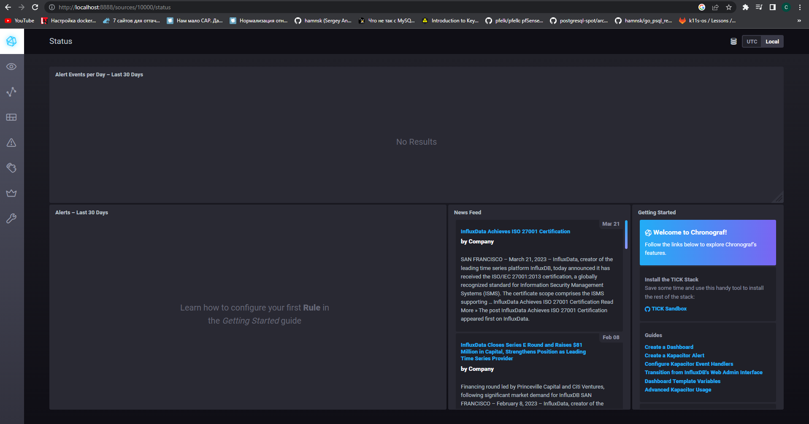
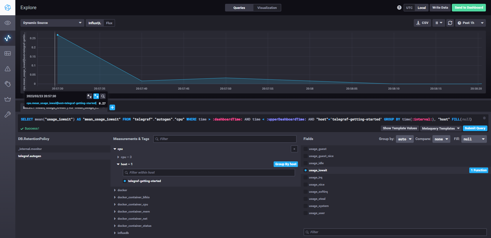

# Домашнее задание к занятию "13.Системы мониторинга"

## Обязательные задания

1. Вас пригласили настроить мониторинг на проект. На онбординге вам рассказали, что проект представляет из себя 
платформу для вычислений с выдачей текстовых отчетов, которые сохраняются на диск. Взаимодействие с платформой 
осуществляется по протоколу http. Также вам отметили, что вычисления загружают ЦПУ. Какой минимальный набор метрик вы
выведите в мониторинг и почему?  
Решение:
1) CPU - так как вычисления загружают ЦПУ  
2) NetTraffic - мониторинг сетевого трафика  
3) Http ответы - так как взаимодействие осуществляется по http, нам необходимо отслеживать коды ответов http, разделяя их по класса (5.х.х, 4.х.х и т.д)  
4) Мониторинг inodes - так как документы записываются, необходимо мониторить загрузку файловой системы  
5) IOPS - запись и чтение  
6) RAM/swap - необходимо всегда мониторить оперативную память и swap память  
7) Добавил бы время отклика, так как нам необходимо знать за какое время выполняется запрос пользователя  
#
2. Менеджер продукта посмотрев на ваши метрики сказал, что ему непонятно что такое RAM/inodes/CPUla. Также он сказал, 
что хочет понимать, насколько мы выполняем свои обязанности перед клиентами и какое качество обслуживания. Что вы 
можете ему предложить?  
Решение:  
1) Обьяснил бы, что обозначает каждая из метрик и также в Dashbord добавил бы пометки на русском языке  
2) Обратил бы внимание менеджера на время отклика и на количество ошибок HTTP, так как пользователям важно, чтобы запросы выполнялись быстро и без ошибок. Из этого вытекает SLA, SLO, SLI.  
#
3. Вашей DevOps команде в этом году не выделили финансирование на построение системы сбора логов. Разработчики в свою 
очередь хотят видеть все ошибки, которые выдают их приложения. Какое решение вы можете предпринять в этой ситуации, 
чтобы разработчики получали ошибки приложения?  
Решение:  
Настроил бы GrayLog, для мониторинга ошибок в логах  
#
4. Вы, как опытный SRE, сделали мониторинг, куда вывели отображения выполнения SLA=99% по http кодам ответов. 
Вычисляете этот параметр по следующей формуле: summ_2xx_requests/summ_all_requests. Данный параметр не поднимается выше 
70%, но при этом в вашей системе нет кодов ответа 5xx и 4xx. Где у вас ошибка?  
Решение: Как я понимаю, мы неверно рассчитываем. Корректная формула  
```
(summ_2xx_requests + summ_3xx_requests) / (summ_all_requests)
```
#
5. Опишите основные плюсы и минусы pull и push систем мониторинга.  
Push:  
Плюсы:  
1) Упрощение репликации данных в разные системы мониторинга или их резервные копии  
2) Более гибкая настройка отправки пакетов данных с метриками  
3) UDP — это менее затратный способ передачи данных, из-за чего может возрасти  
Минусы:  
1) Агенты могут забить весь трафик своими запросами (встречалась данная проблема на работе=)  
2) Безопасникам может не понравится, то что данные передаются
3) Сервер не контролирует, что ему шлют агенты  
Pull:  
Плюсы:  
1) Легче контролировать подлинность данных  
2) Можно настроить единый proxy server до всех агентов с TLS  
3) Упрощённая отладка получения данных с агентов  
Минусы:  
1) Затратный метод, так как данные передаются только когда пришел ответ на pull-запрос  
2) Трудоемкость масштабирования  
#
6. Какие из ниже перечисленных систем относятся к push модели, а какие к pull? А может есть гибридные?

    - Prometheus (Pull)
    - TICK (Push)
    - Zabbix (Гибрид)
    - VictoriaMetrics (Гибрид)
    - Nagios (Push)
#
7. Склонируйте себе [репозиторий](https://github.com/influxdata/sandbox/tree/master) и запустите TICK-стэк, 
используя технологии docker и docker-compose.

В виде решения на это упражнение приведите выводы команд с вашего компьютера (виртуальной машины):

    - curl http://localhost:8086/ping
    - curl http://localhost:8888
    - curl http://localhost:9092/kapacitor/v1/ping  
Решение:  
```
lepis@lepis:~/programs/sandbox$ curl http://localhost:8086/ping
lepis@lepis:~/programs/sandbox$ curl http://localhost:8888
<!DOCTYPE html><html><head><link rel="stylesheet" href="/index.c708214f.css"><meta http-equiv="Content-type" content="text/html; charset=utf-8"><title>Chronograf</title><link rel="icon shortcut" href="/favicon.70d63073.ico"></head><body> <div id="react-root" data-basepath=""></div> <script type="module" src="/index.c5ba09e6.js"></script><script src="/index.59cbcbd2.js" nomodule="" defer></script> </body></html> 
lepis@lepis:~/programs/sandbox$ curl http://localhost:9092/kapacitor/v1/ping
```
А также скриншот веб-интерфейса ПО chronograf (`http://localhost:8888`).  



P.S.: если при запуске некоторые контейнеры будут падать с ошибкой - проставьте им режим `Z`, например
`./data:/var/lib:Z`
#
8. Перейдите в веб-интерфейс Chronograf (`http://localhost:8888`) и откройте вкладку `Data explorer`.

    - Нажмите на кнопку `Add a query`
    - Изучите вывод интерфейса и выберите БД `telegraf.autogen`
    - В `measurments` выберите mem->host->telegraf_container_id , а в `fields` выберите used_percent. 
    Внизу появится график утилизации оперативной памяти в контейнере telegraf.
    - Вверху вы можете увидеть запрос, аналогичный SQL-синтаксису. 
    Поэкспериментируйте с запросом, попробуйте изменить группировку и интервал наблюдений.

Для выполнения задания приведите скриншот с отображением метрик утилизации места на диске 
(disk->host->telegraf_container_id) из веб-интерфейса.  
Решение:  
  
#
9. Изучите список [telegraf inputs](https://github.com/influxdata/telegraf/tree/master/plugins/inputs). 
Добавьте в конфигурацию telegraf следующий плагин - [docker](https://github.com/influxdata/telegraf/tree/master/plugins/inputs/docker):
```
[[inputs.docker]]
  endpoint = "unix:///var/run/docker.sock"
```

Дополнительно вам может потребоваться донастройка контейнера telegraf в `docker-compose.yml` дополнительного volume и 
режима privileged:
```
  telegraf:
    image: telegraf:1.4.0
    privileged: true
    volumes:
      - ./etc/telegraf.conf:/etc/telegraf/telegraf.conf:Z
      - /var/run/docker.sock:/var/run/docker.sock:Z
    links:
      - influxdb
    ports:
      - "8092:8092/udp"
      - "8094:8094"
      - "8125:8125/udp"
```

После настройке перезапустите telegraf, обновите веб интерфейс и приведите скриншотом список `measurments` в 
веб-интерфейсе базы telegraf.autogen . Там должны появиться метрики, связанные с docker.

Факультативно можете изучить какие метрики собирает telegraf после выполнения данного задания.  
Решение:  

## Дополнительное задание (со звездочкой*) - необязательно к выполнению

1. Вы устроились на работу в стартап. На данный момент у вас нет возможности развернуть полноценную систему 
мониторинга, и вы решили самостоятельно написать простой python3-скрипт для сбора основных метрик сервера. Вы, как 
опытный системный-администратор, знаете, что системная информация сервера лежит в директории `/proc`. 
Также, вы знаете, что в системе Linux есть  планировщик задач cron, который может запускать задачи по расписанию.

Суммировав все, вы спроектировали приложение, которое:
- является python3 скриптом
- собирает метрики из папки `/proc`
- складывает метрики в файл 'YY-MM-DD-awesome-monitoring.log' в директорию /var/log 
(YY - год, MM - месяц, DD - день)
- каждый сбор метрик складывается в виде json-строки, в виде:
  + timestamp (временная метка, int, unixtimestamp)
  + metric_1 (метрика 1)
  + metric_2 (метрика 2)
  
     ...
     
  + metric_N (метрика N)
  
- сбор метрик происходит каждую 1 минуту по cron-расписанию

Для успешного выполнения задания нужно привести:

а) работающий код python3-скрипта,

б) конфигурацию cron-расписания,

в) пример верно сформированного 'YY-MM-DD-awesome-monitoring.log', имеющий не менее 5 записей,

P.S.: количество собираемых метрик должно быть не менее 4-х.
P.P.S.: по желанию можно себя не ограничивать только сбором метрик из `/proc`.

2. В веб-интерфейсе откройте вкладку `Dashboards`. Попробуйте создать свой dashboard с отображением:

    - утилизации ЦПУ
    - количества использованного RAM
    - утилизации пространства на дисках
    - количество поднятых контейнеров
    - аптайм
    - ...
    - фантазируйте)
    
    ---

### Как оформить ДЗ?

Выполненное домашнее задание пришлите ссылкой на .md-файл в вашем репозитории.

---

