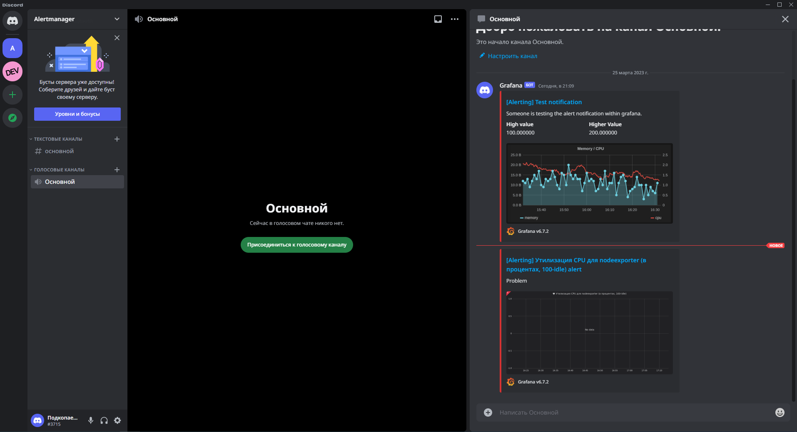
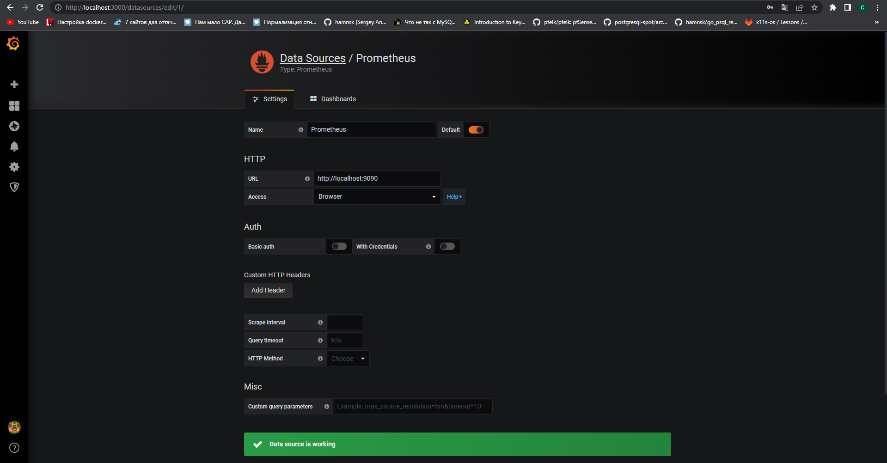
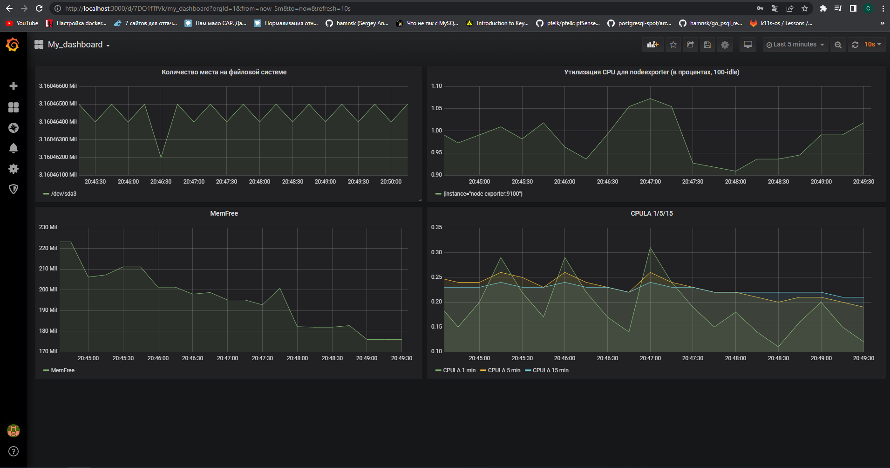
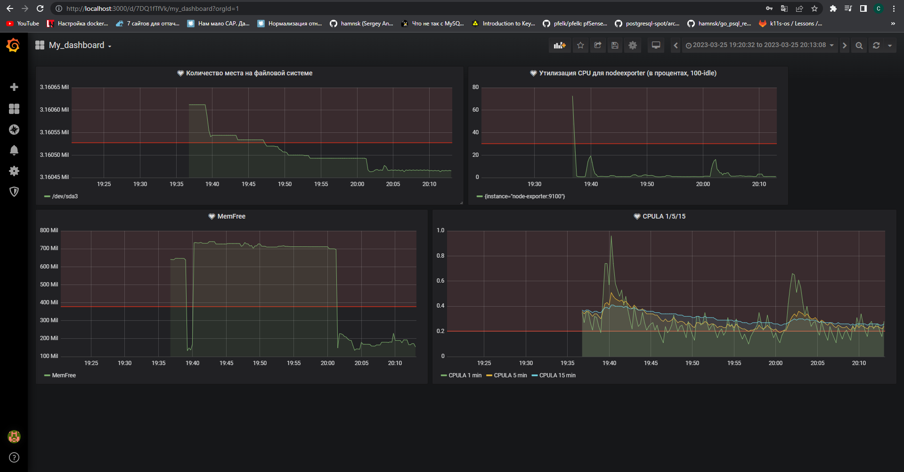

# Домашнее задание к занятию "14.Средство визуализации Grafana"

## Задание повышенной сложности

**В части задания 1** не используйте директорию [help](./help) для сборки проекта, самостоятельно разверните grafana, где в 
роли источника данных будет выступать prometheus, а сборщиком данных node-exporter:
- grafana
- prometheus-server
- prometheus node-exporter

За дополнительными материалами, вы можете обратиться в официальную документацию grafana и prometheus.

В решении к домашнему заданию приведите также все конфигурации/скрипты/манифесты, которые вы 
использовали в процессе решения задания.  
Решение:   
```
lepis@lepis:~/Homework/netology-homework/My_homework/devops-netology/3_CI_monitoring_and_settings_management/10-monitoring-03-grafana/src$ docker-compose ps
    Name                   Command               State                    Ports                  
-------------------------------------------------------------------------------------------------
grafana         /run.sh                          Up      0.0.0.0:3000->3000/tcp,:::3000->3000/tcp
node-exporter   /bin/node_exporter --path. ...   Up      0.0.0.0:9100->9100/tcp,:::9100->9100/tcp
prometheus      /bin/prometheus --config.f ...   Up      0.0.0.0:9090->9090/tcp,:::9090->9090/tcp
lepis@lepis:~/Homework/netology-homework/My_homework/devops-netology/3_CI_monitoring_and_settings_management/10-monitoring-03-grafana/src$ docker ps
CONTAINER ID   IMAGE                        COMMAND                  CREATED          STATUS          PORTS                                       NAMES
b8bd4864bbde   grafana/grafana:6.7.2        "/run.sh"                49 seconds ago   Up 49 seconds   0.0.0.0:3000->3000/tcp, :::3000->3000/tcp   grafana
0bafc0e679ed   prom/prometheus:v2.17.1      "/bin/prometheus --c…"   50 seconds ago   Up 49 seconds   0.0.0.0:9090->9090/tcp, :::9090->9090/tcp   prometheus
60c44cd490f2   prom/node-exporter:v0.18.1   "/bin/node_exporter …"   50 seconds ago   Up 49 seconds   0.0.0.0:9100->9100/tcp, :::9100->9100/tcp   node-exporter
```
- [docker-compose.yml](https://github.com/Lepisok/devops-netology/blob/main/3_CI_monitoring_and_settings_management/10-monitoring-03-grafana/src/docker-compose.yml)  
- [prometheus.yml](https://github.com/Lepisok/devops-netology/blob/main/3_CI_monitoring_and_settings_management/10-monitoring-03-grafana/src/prometheus/prometheus.yml)  
**В части задания 3** вы должны самостоятельно завести удобный для вас канал нотификации, например Telegram или Email
и отправить туда тестовые события.

В решении приведите скриншоты тестовых событий из каналов нотификаций.  


## Обязательные задания

### Задание 1

Подключите поднятый вами prometheus как источник данных.

Решение домашнего задания - скриншот веб-интерфейса grafana со списком подключенных Datasource.  

## Задание 2
Изучите самостоятельно ресурсы:
- [PromQL tutorial for beginners and humans](https://valyala.medium.com/promql-tutorial-for-beginners-9ab455142085)
- [Understanding Machine CPU usage](https://www.robustperception.io/understanding-machine-cpu-usage)
- [Introduction to PromQL, the Prometheus query language](https://grafana.com/blog/2020/02/04/introduction-to-promql-the-prometheus-query-language/)

Создайте Dashboard и в ней создайте следующие Panels:
- Утилизация CPU для nodeexporter (в процентах, 100-idle)
- CPULA 1/5/15
- Количество свободной оперативной памяти
- Количество места на файловой системе

Для решения данного ДЗ приведите promql запросы для выдачи этих метрик, а также скриншот получившейся Dashboard.  
Решение:  
- Утилизация CPU для nodeexporter (в процентах, 100-idle)  
100 - (avg by (instance) (rate(node_cpu_seconds_total{job="node",mode="idle"}[1m])) * 100)  
- CPULA 1/5/15  
node_load1{instance="node-exporter:9100",job="node"}  
node_load5{instance="node-exporter:9100",job="node"}  
node_load15{instance="node-exporter:9100",job="node"}  
- Количество свободной оперативной памяти  
node_memory_MemFree_bytes{instance="node-exporter:9100",job="node"}  
- Количество места на файловой системе  
node_filesystem_files_free{device="/dev/sda3",fstype="ext4",instance="node-exporter:9100",job="node"}  
Dashboard:  
  
## Задание 3
Создайте для каждой Dashboard подходящее правило alert (можно обратиться к первой лекции в блоке "Мониторинг").

Для решения ДЗ - приведите скриншот вашей итоговой Dashboard.  

## Задание 4
Сохраните ваш Dashboard.

Для этого перейдите в настройки Dashboard, выберите в боковом меню "JSON MODEL".

Далее скопируйте отображаемое json-содержимое в отдельный файл и сохраните его.

В решении задания - приведите листинг этого файла.  
[json_file]()