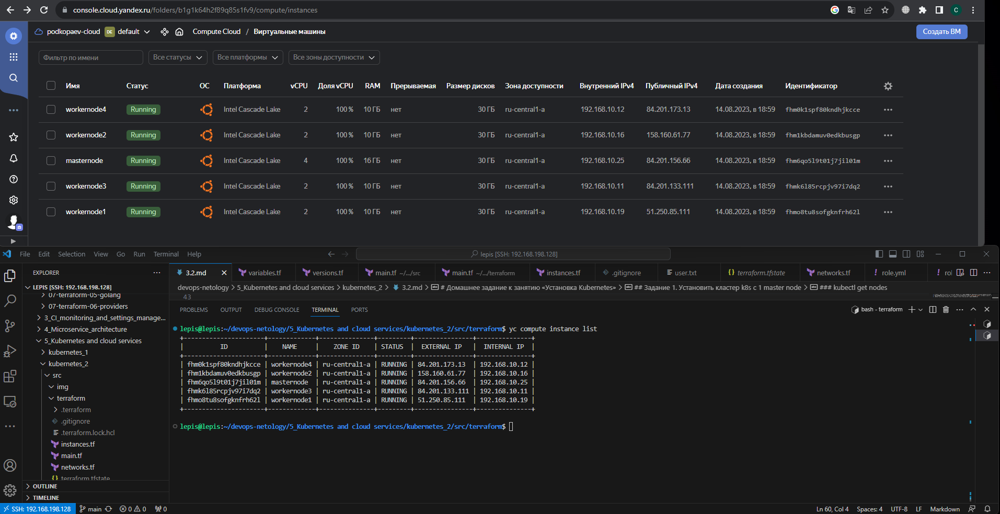
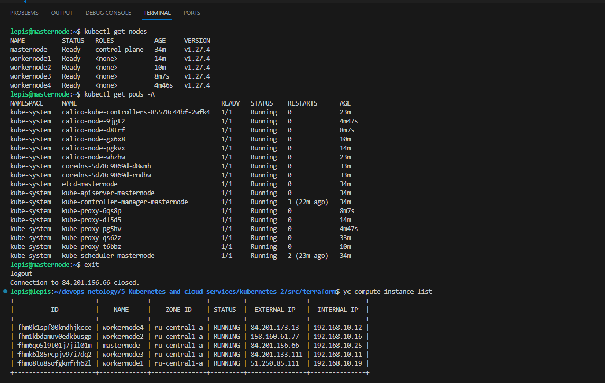

# Домашнее задание к занятию «Установка Kubernetes»

### Цель задания

Установить кластер K8s.

### Чеклист готовности к домашнему заданию

1. Развёрнутые ВМ с ОС Ubuntu 20.04-lts.


### Инструменты и дополнительные материалы, которые пригодятся для выполнения задания

1. [Инструкция по установке kubeadm](https://kubernetes.io/docs/setup/production-environment/tools/kubeadm/create-cluster-kubeadm/).
2. [Документация kubespray](https://kubespray.io/).

-----

### Задание 1. Установить кластер k8s с 1 master node

1. Подготовка работы кластера из 5 нод: 1 мастер и 4 рабочие ноды.
2. В качестве CRI — containerd.
3. Запуск etcd производить на мастере.
4. Способ установки выбрать самостоятельно.

## Дополнительные задания (со звёздочкой)

**Настоятельно рекомендуем выполнять все задания под звёздочкой.** Их выполнение поможет глубже разобраться в материале.   
Задания под звёздочкой необязательные к выполнению и не повлияют на получение зачёта по этому домашнему заданию. 

------
### Задание 2*. Установить HA кластер

1. Установить кластер в режиме HA.
2. Использовать нечётное количество Master-node.
3. Для cluster ip использовать keepalived или другой способ.

### Правила приёма работы

1. Домашняя работа оформляется в своем Git-репозитории в файле README.md. Выполненное домашнее задание пришлите ссылкой на .md-файл в вашем репозитории.
2. Файл README.md должен содержать скриншоты вывода необходимых команд `kubectl get nodes`, а также скриншоты результатов.
3. Репозиторий должен содержать тексты манифестов или ссылки на них в файле README.md.


## Решение:
## Задание 1. Установить кластер k8s с 1 master node  
### Выбран способ установки - kubeadm  
### Terrafarm скрипты для разворачивания VM  
[terraform-scripts](https://github.com/Lepisok/devops-netology/tree/main/5_Kubernetes%20and%20cloud%20services/kubernetes_2/src/terraform)

### Скриншот созданных VM  
  
### kubectl describe nodes - после установки плагина calico  
```bash
lepis@masternode:~$ kubectl get nodes
NAME         STATUS   ROLES           AGE   VERSION
masternode   Ready    control-plane   14m   v1.27.4
lepis@masternode:~$ kubectl describe nodes
Name:               masternode
Roles:              control-plane
Labels:             beta.kubernetes.io/arch=amd64
                    beta.kubernetes.io/os=linux
                    kubernetes.io/arch=amd64
                    kubernetes.io/hostname=masternode
                    kubernetes.io/os=linux
                    node-role.kubernetes.io/control-plane=
                    node.kubernetes.io/exclude-from-external-load-balancers=
Annotations:        kubeadm.alpha.kubernetes.io/cri-socket: unix:///var/run/containerd/containerd.sock
                    node.alpha.kubernetes.io/ttl: 0
                    projectcalico.org/IPv4Address: 192.168.10.25/24
                    projectcalico.org/IPv4IPIPTunnelAddr: 10.244.181.0
                    volumes.kubernetes.io/controller-managed-attach-detach: true
CreationTimestamp:  Mon, 14 Aug 2023 16:07:14 +0000
Taints:             node-role.kubernetes.io/control-plane:NoSchedule
Unschedulable:      false
Lease:
  HolderIdentity:  masternode
  AcquireTime:     <unset>
  RenewTime:       Mon, 14 Aug 2023 16:21:27 +0000
Conditions:
  Type                 Status  LastHeartbeatTime                 LastTransitionTime                Reason                       Message
  ----                 ------  -----------------                 ------------------                ------                       -------
  NetworkUnavailable   False   Mon, 14 Aug 2023 16:19:13 +0000   Mon, 14 Aug 2023 16:19:13 +0000   CalicoIsUp                   Calico is running on this node
  MemoryPressure       False   Mon, 14 Aug 2023 16:19:58 +0000   Mon, 14 Aug 2023 16:07:11 +0000   KubeletHasSufficientMemory   kubelet has sufficient memory available
  DiskPressure         False   Mon, 14 Aug 2023 16:19:58 +0000   Mon, 14 Aug 2023 16:07:11 +0000   KubeletHasNoDiskPressure     kubelet has no disk pressure
  PIDPressure          False   Mon, 14 Aug 2023 16:19:58 +0000   Mon, 14 Aug 2023 16:07:11 +0000   KubeletHasSufficientPID      kubelet has sufficient PID available
  Ready                True    Mon, 14 Aug 2023 16:19:58 +0000   Mon, 14 Aug 2023 16:18:46 +0000   KubeletReady                 kubelet is posting ready status. AppArmor enabled
Addresses:
  InternalIP:  192.168.10.25
  Hostname:    masternode
Capacity:
  cpu:                4
  ephemeral-storage:  30868032Ki
  hugepages-1Gi:      0
  hugepages-2Mi:      0
  memory:             16381180Ki
  pods:               110
Allocatable:
  cpu:                4
  ephemeral-storage:  28447978245
  hugepages-1Gi:      0
  hugepages-2Mi:      0
  memory:             16278780Ki
  pods:               110
System Info:
  Machine ID:                 23000007c6c6d60b54f40199e72a8036
  System UUID:                23000007-c6c6-d60b-54f4-0199e72a8036
  Boot ID:                    b8a9a701-d188-401d-b150-52eefc1889c0
  Kernel Version:             5.4.0-155-generic
  OS Image:                   Ubuntu 20.04.6 LTS
  Operating System:           linux
  Architecture:               amd64
  Container Runtime Version:  containerd://1.7.2
  Kubelet Version:            v1.27.4
  Kube-Proxy Version:         v1.27.4
PodCIDR:                      10.244.0.0/24
PodCIDRs:                     10.244.0.0/24
Non-terminated Pods:          (9 in total)
  Namespace                   Name                                        CPU Requests  CPU Limits  Memory Requests  Memory Limits  Age
  ---------                   ----                                        ------------  ----------  ---------------  -------------  ---
  kube-system                 calico-kube-controllers-85578c44bf-2wfk4    0 (0%)        0 (0%)      0 (0%)           0 (0%)         3m46s
  kube-system                 calico-node-whzhw                           250m (6%)     0 (0%)      0 (0%)           0 (0%)         3m47s
  kube-system                 coredns-5d78c9869d-d8wmh                    100m (2%)     0 (0%)      70Mi (0%)        170Mi (1%)     13m
  kube-system                 coredns-5d78c9869d-rndbw                    100m (2%)     0 (0%)      70Mi (0%)        170Mi (1%)     13m
  kube-system                 etcd-masternode                             100m (2%)     0 (0%)      100Mi (0%)       0 (0%)         14m
  kube-system                 kube-apiserver-masternode                   250m (6%)     0 (0%)      0 (0%)           0 (0%)         14m
  kube-system                 kube-controller-manager-masternode          200m (5%)     0 (0%)      0 (0%)           0 (0%)         14m
  kube-system                 kube-proxy-qs62z                            0 (0%)        0 (0%)      0 (0%)           0 (0%)         13m
  kube-system                 kube-scheduler-masternode                   100m (2%)     0 (0%)      0 (0%)           0 (0%)         14m
Allocated resources:
  (Total limits may be over 100 percent, i.e., overcommitted.)
  Resource           Requests     Limits
  --------           --------     ------
  cpu                1100m (27%)  0 (0%)
  memory             240Mi (1%)   340Mi (2%)
  ephemeral-storage  0 (0%)       0 (0%)
  hugepages-1Gi      0 (0%)       0 (0%)
  hugepages-2Mi      0 (0%)       0 (0%)
Events:
  Type     Reason                   Age                From             Message
  ----     ------                   ----               ----             -------
  Normal   Starting                 13m                kube-proxy       
  Normal   NodeHasSufficientPID     14m (x7 over 14m)  kubelet          Node masternode status is now: NodeHasSufficientPID
  Normal   NodeAllocatableEnforced  14m                kubelet          Updated Node Allocatable limit across pods
  Warning  InvalidDiskCapacity      14m                kubelet          invalid capacity 0 on image filesystem
  Normal   NodeHasSufficientMemory  14m (x8 over 14m)  kubelet          Node masternode status is now: NodeHasSufficientMemory
  Normal   NodeHasNoDiskPressure    14m (x7 over 14m)  kubelet          Node masternode status is now: NodeHasNoDiskPressure
  Normal   Starting                 14m                kubelet          Starting kubelet.
  Warning  InvalidDiskCapacity      14m                kubelet          invalid capacity 0 on image filesystem
  Normal   NodeAllocatableEnforced  14m                kubelet          Updated Node Allocatable limit across pods
  Normal   NodeHasSufficientMemory  14m                kubelet          Node masternode status is now: NodeHasSufficientMemory
  Normal   NodeHasNoDiskPressure    14m                kubelet          Node masternode status is now: NodeHasNoDiskPressure
  Normal   NodeHasSufficientPID     14m                kubelet          Node masternode status is now: NodeHasSufficientPID
  Normal   RegisteredNode           13m                node-controller  Node masternode event: Registered Node masternode in Controller
  Normal   NodeReady                2m51s              kubelet          Node masternode status is now: NodeReady
  Normal   RegisteredNode           2m43s              node-controller  Node masternode event: Registered Node masternode in Controller
  Normal   RegisteredNode           110s               node-controller  Node masternode event: Registered Node masternode in Controller
```


### kubectl get nodes - подключенные ноды
``` bash
lepis@masternode:~$ kubectl get nodes
NAME          STATUS   ROLES           AGE     VERSION
masternode    Ready    control-plane   34m     v1.27.4
workernode1   Ready    <none>          14m     v1.27.4
workernode2   Ready    <none>          10m     v1.27.4
workernode3   Ready    <none>          8m7s    v1.27.4
workernode4   Ready    <none>          4m46s   v1.27.4
```


### kubectl get pods -A
``` bash
lepis@masternode:~$ kubectl get pods -A
NAMESPACE     NAME                                       READY   STATUS    RESTARTS      AGE
kube-system   calico-kube-controllers-85578c44bf-2wfk4   1/1     Running   0             23m
kube-system   calico-node-9jgt2                          1/1     Running   0             4m47s
kube-system   calico-node-d8trf                          1/1     Running   0             8m7s
kube-system   calico-node-gx6x8                          1/1     Running   0             10m
kube-system   calico-node-pgkvx                          1/1     Running   0             14m
kube-system   calico-node-whzhw                          1/1     Running   0             23m
kube-system   coredns-5d78c9869d-d8wmh                   1/1     Running   0             33m
kube-system   coredns-5d78c9869d-rndbw                   1/1     Running   0             33m
kube-system   etcd-masternode                            1/1     Running   0             34m
kube-system   kube-apiserver-masternode                  1/1     Running   0             34m
kube-system   kube-controller-manager-masternode         1/1     Running   3 (22m ago)   34m
kube-system   kube-proxy-6qs8p                           1/1     Running   0             8m7s
kube-system   kube-proxy-dl5d5                           1/1     Running   0             14m
kube-system   kube-proxy-pg5hv                           1/1     Running   0             4m47s
kube-system   kube-proxy-qs62z                           1/1     Running   0             33m
kube-system   kube-proxy-t6bbz                           1/1     Running   0             10m
kube-system   kube-scheduler-masternode                  1/1     Running   2 (23m ago)   34m
```  

### Финальный скриншот
 