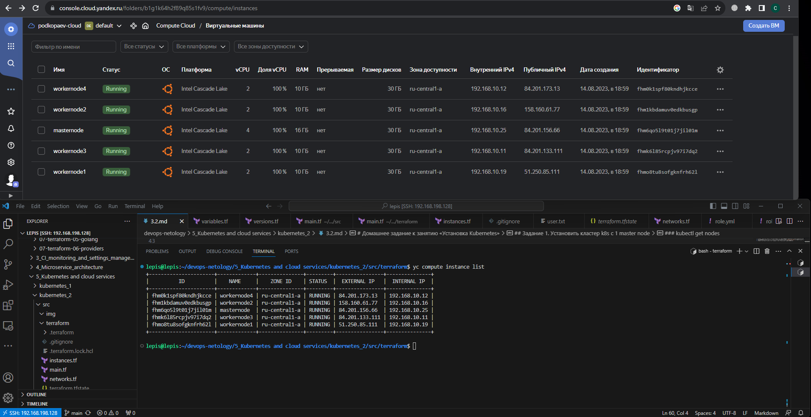
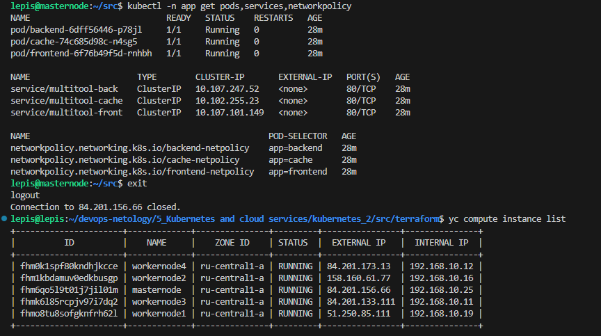

# Домашнее задание к занятию «Как работает сеть в K8s»

### Цель задания

Настроить сетевую политику доступа к подам.

### Чеклист готовности к домашнему заданию

1. Кластер K8s с установленным сетевым плагином Calico.

### Инструменты и дополнительные материалы, которые пригодятся для выполнения задания

1. [Документация Calico](https://www.tigera.io/project-calico/).
2. [Network Policy](https://kubernetes.io/docs/concepts/services-networking/network-policies/).
3. [About Network Policy](https://docs.projectcalico.org/about/about-network-policy).

-----

### Задание 1. Создать сетевую политику или несколько политик для обеспечения доступа

1. Создать deployment'ы приложений frontend, backend и cache и соответсвующие сервисы.
2. В качестве образа использовать network-multitool.
3. Разместить поды в namespace App.
4. Создать политики, чтобы обеспечить доступ frontend -> backend -> cache. Другие виды подключений должны быть запрещены.
5. Продемонстрировать, что трафик разрешён и запрещён.

### Правила приёма работы

1. Домашняя работа оформляется в своём Git-репозитории в файле README.md. Выполненное домашнее задание пришлите ссылкой на .md-файл в вашем репозитории.
2. Файл README.md должен содержать скриншоты вывода необходимых команд, а также скриншоты результатов.
3. Репозиторий должен содержать тексты манифестов или ссылки на них в файле README.md.


## Решение:
### Задание 1. Создать сетевую политику или несколько политик для обеспечения доступа
### Terrafarm скрипты для разворачивания VM  
[terraform-scripts](https://github.com/Lepisok/devops-netology/tree/main/5_Kubernetes%20and%20cloud%20services/kubernetes_3/src/terraform)
### Манифесты
[deployment](https://github.com/Lepisok/devops-netology/blob/main/5_Kubernetes%20and%20cloud%20services/kubernetes_3/src/manifest/deployment.yml)  
[services](https://github.com/Lepisok/devops-netology/blob/main/5_Kubernetes%20and%20cloud%20services/kubernetes_3/src/manifest/service.yml)  
[network-policy](https://github.com/Lepisok/devops-netology/blob/main/5_Kubernetes%20and%20cloud%20services/kubernetes_3/src/manifest/policy.yml)  
### Скриншот созданных VM  
  


### Создаём нужный namespace
```bash
lepis@masternode:~/src$ kubectl create namespace app
namespace/app created
lepis@masternode:~/src$ kubectl get namespace
NAME              STATUS   AGE
app               Active   9s
default           Active   51m
kube-node-lease   Active   51m
kube-public       Active   51m
kube-system       Active   51m
lepis@masternode:~/src$ kubectl config set-context --current --namespace=app
Context "kubernetes-admin@kubernetes" modified.
lepis@masternode:~/src$ kubectl config view --minify | grep namespace:
    namespace: app
```

### Создаём pods, services, policy
```bash
lepis@masternode:~/src$ kubectl apply -f deployment.yml 
deployment.apps/frontend created
deployment.apps/backend created
deployment.apps/cache created
lepis@masternode:~/src$ kubectl apply -f service.yml 
service/multitool-front created
service/multitool-back created
service/multitool-cache created
lepis@masternode:~/src$ kubectl apply -f policy.yml 
networkpolicy.networking.k8s.io/frontend-netpolicy created
networkpolicy.networking.k8s.io/backend-netpolicy created
networkpolicy.networking.k8s.io/cache-netpolicy created
```

### kubectl -n app get pods,services,networkpolicy - проверяем, что все создано в namespace app
```bash
lepis@masternode:~/src$ kubectl get pods,services,networkpolicy
NAME                            READY   STATUS    RESTARTS   AGE
pod/backend-6dff56446-p78jl     1/1     Running   0          2m33s
pod/cache-74c685d98c-n4sg5      1/1     Running   0          2m33s
pod/frontend-6f76b49f5d-rnhbh   1/1     Running   0          2m34s

NAME                      TYPE        CLUSTER-IP       EXTERNAL-IP   PORT(S)   AGE
service/multitool-back    ClusterIP   10.107.247.52    <none>        80/TCP    2m29s
service/multitool-cache   ClusterIP   10.102.255.23    <none>        80/TCP    2m29s
service/multitool-front   ClusterIP   10.107.101.149   <none>        80/TCP    2m29s

NAME                                                 POD-SELECTOR   AGE
networkpolicy.networking.k8s.io/backend-netpolicy    app=backend    2m25s
networkpolicy.networking.k8s.io/cache-netpolicy      app=cache      2m25s
networkpolicy.networking.k8s.io/frontend-netpolicy   app=frontend   2m25s
lepis@masternode:~/src$ 
```

### Проверка сетевых политик
1. fronted -> backend (успешно)
```bash
lepis@masternode:~/src$ kubectl -n app exec frontend-6f76b49f5d-rnhbh  -- curl -s http://multitool-back.app.svc.cluster.local  
Praqma Network MultiTool (with NGINX) - backend-6dff56446-p78jl - 10.244.212.1 - HTTP: 80 , HTTPS: 443  
```
2. backend -> cache (успешно)  
``` bash  
lepis@masternode:~/src$ kubectl -n app exec backend-6dff56446-p78jl  -- curl -s http://multitool-cache.app.svc.cluster.local  
Praqma Network MultiTool (with NGINX) - cache-74c685d98c-n4sg5 - 10.244.241.129 - HTTP: 80 , HTTPS: 443  
```  
3. cache -> backend (заблокирован)  
```bash
lepis@masternode:~/src$ kubectl -n app exec cache-74c685d98c-n4sg5  -- curl -s http://multitool-back.app.svc.cluster.local  
command terminated with exit code 7  
```  
4. cache -> fronted (заблокирован)  
```bash
lepis@masternode:~/src$ kubectl -n app exec cache-74c685d98c-n4sg5  -- curl -s http://multitool-front.app.svc.cluster.local  
command terminated with exit code 7  
```
5. fronted -> cache (заблокирован) 
```bash  
lepis@masternode:~/src$ kubectl -n app exec frontend-6f76b49f5d-rnhbh  -- curl -s http://multitool-cache.app.svc.cluster.local  
command terminated with exit code 7  
```  
6. backend -> fronted (заблокирован)
```bash  
lepis@masternode:~/src$ kubectl -n app exec backend-6dff56446-p78jl  -- curl -s http://multitool-front.app.svc.cluster.local  
command terminated with exit code 7  
```

### Финальный скриншот
 
