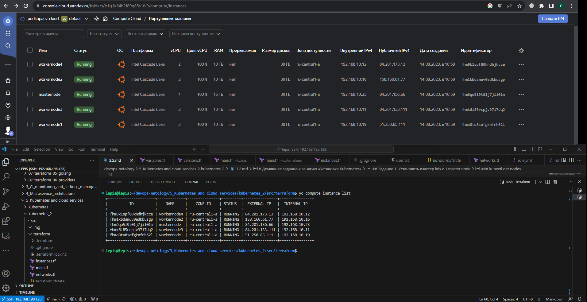
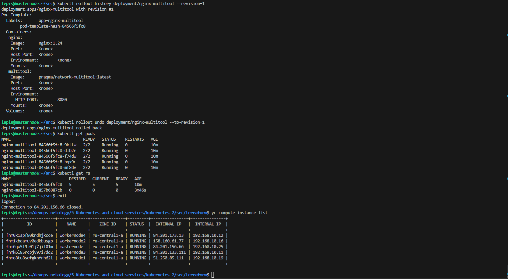

# Домашнее задание к занятию «Обновление приложений»

### Цель задания

Выбрать и настроить стратегию обновления приложения.

### Чеклист готовности к домашнему заданию

1. Кластер K8s.

### Инструменты и дополнительные материалы, которые пригодятся для выполнения задания

1. [Документация Updating a Deployment](https://kubernetes.io/docs/concepts/workloads/controllers/deployment/#updating-a-deployment).
2. [Статья про стратегии обновлений](https://habr.com/ru/companies/flant/articles/471620/).

-----

### Задание 1. Выбрать стратегию обновления приложения и описать ваш выбор

1. Имеется приложение, состоящее из нескольких реплик, которое требуется обновить.
2. Ресурсы, выделенные для приложения, ограничены, и нет возможности их увеличить.
3. Запас по ресурсам в менее загруженный момент времени составляет 20%.
4. Обновление мажорное, новые версии приложения не умеют работать со старыми.
5. Вам нужно объяснить свой выбор стратегии обновления приложения.

### Задание 2. Обновить приложение

1. Создать deployment приложения с контейнерами nginx и multitool. Версию nginx взять 1.19. Количество реплик — 5.
2. Обновить версию nginx в приложении до версии 1.20, сократив время обновления до минимума. Приложение должно быть доступно.
3. Попытаться обновить nginx до версии 1.28, приложение должно оставаться доступным.
4. Откатиться после неудачного обновления.

## Дополнительные задания — со звёздочкой*

Задания дополнительные, необязательные к выполнению, они не повлияют на получение зачёта по домашнему заданию. **Но мы настоятельно рекомендуем вам выполнять все задания со звёздочкой.** Это поможет лучше разобраться в материале.   

### Задание 3*. Создать Canary deployment

1. Создать два deployment'а приложения nginx.
2. При помощи разных ConfigMap сделать две версии приложения — веб-страницы.
3. С помощью ingress создать канареечный деплоймент, чтобы можно было часть трафика перебросить на разные версии приложения.

### Правила приёма работы

1. Домашняя работа оформляется в своем Git-репозитории в файле README.md. Выполненное домашнее задание пришлите ссылкой на .md-файл в вашем репозитории.
2. Файл README.md должен содержать скриншоты вывода необходимых команд, а также скриншоты результатов.
3. Репозиторий должен содержать тексты манифестов или ссылки на них в файле README.md.


## Решение:  
### Скриншот созданных VM  
  
### Манифесты  
[deployment.yml](https://github.com/Lepisok/devops-netology/blob/main/5_Kubernetes%20and%20cloud%20services/kubernetes_4/src/manifest/deployment.yml)  
### Задание 1. Выбрать стратегию обновления приложения и описать ваш выбор  
Я бы выбрал Canary deployment, т.к мы ограничены в ресурсах и так же необходимо настроить трафик, чтобы новые версии приложений не имели доступ к старым версиям и наоборот. Данный способ поможет также снизить количество недовольных клиентов, так как мы, обновим например только один под и пропустим туда маленький трафик, а всю остальную нагрузку отправим на старые версии. Если все будет успешно, то постепенно поменяем все старые версии. Возможно нам бы подошел бы еще Rolling Deployments, если бы не была пункта про сетевой трафик, Rolling Deployments не умеет в сетевой трафик =)  

### Задание 2. Обновить приложение  
1. Создаем Deployment
```bash
lepis@masternode:~/src$ kubectl get pods
NAME                               READY   STATUS    RESTARTS   AGE
nginx-multitool-84566f5fc8-9kttw   2/2     Running   0          2m31s
nginx-multitool-84566f5fc8-dlb2r   2/2     Running   0          2m31s
nginx-multitool-84566f5fc8-f74dw   2/2     Running   0          2m31s
nginx-multitool-84566f5fc8-hqx9c   2/2     Running   0          2m31s
nginx-multitool-84566f5fc8-mf8dv   2/2     Running   0          2m31s
lepis@masternode:~/src$ kubectl get pods
NAME                               READY   STATUS    RESTARTS   AGE
nginx-multitool-84566f5fc8-9kttw   2/2     Running   0          2m31s
nginx-multitool-84566f5fc8-dlb2r   2/2     Running   0          2m31s
nginx-multitool-84566f5fc8-f74dw   2/2     Running   0          2m31s
nginx-multitool-84566f5fc8-hqx9c   2/2     Running   0          2m31s
nginx-multitool-84566f5fc8-mf8dv   2/2     Running   0          2m31s
lepis@masternode:~/src$ kubectl describe deployments nginx-multitool
Name:                   nginx-multitool
Namespace:              app
CreationTimestamp:      Mon, 14 Aug 2023 18:10:46 +0000
Labels:                 app=nginx-multitool
Annotations:            deployment.kubernetes.io/revision: 1
Selector:               app=nginx-multitool
Replicas:               5 desired | 5 updated | 5 total | 5 available | 0 unavailable
StrategyType:           RollingUpdate
MinReadySeconds:        0
RollingUpdateStrategy:  0% max unavailable, 100% max surge
Pod Template:
  Labels:  app=nginx-multitool
  Containers:
   nginx:
    Image:        nginx:1.24
    Port:         <none>
    Host Port:    <none>
    Environment:  <none>
    Mounts:       <none>
   multitool:
    Image:      praqma/network-multitool:latest
    Port:       <none>
    Host Port:  <none>
    Environment:
      HTTP_PORT:  8080
    Mounts:       <none>
  Volumes:        <none>
Conditions:
  Type           Status  Reason
  ----           ------  ------
  Available      True    MinimumReplicasAvailable
  Progressing    True    NewReplicaSetAvailable
OldReplicaSets:  <none>
NewReplicaSet:   nginx-multitool-84566f5fc8 (5/5 replicas created)
Events:
  Type    Reason             Age   From                   Message
  ----    ------             ----  ----                   -------
  Normal  ScalingReplicaSet  5m7s  deployment-controller  Scaled up replica set nginx-multitool-84566f5fc8 to 5
```

2. Обновляем nginx до 1.28. Приложение доступно
```bash
epis@masternode:~/src$ kubectl set image deployment/nginx-multitool nginx=nginx:1.28.0
deployment.apps/nginx-multitool image updated
lepis@masternode:~/src$ kubectl get pods
NAME                               READY   STATUS         RESTARTS   AGE
nginx-multitool-84566f5fc8-9kttw   2/2     Running        0          8m5s
nginx-multitool-84566f5fc8-dlb2r   2/2     Running        0          8m5s
nginx-multitool-84566f5fc8-f74dw   2/2     Running        0          8m5s
nginx-multitool-84566f5fc8-hqx9c   2/2     Running        0          8m5s
nginx-multitool-84566f5fc8-mf8dv   2/2     Running        0          8m5s
nginx-multitool-857b6887cb-5tnll   1/2     ErrImagePull   0          66s
nginx-multitool-857b6887cb-9dpgd   1/2     ErrImagePull   0          66s
nginx-multitool-857b6887cb-h6m7c   1/2     ErrImagePull   0          66s
nginx-multitool-857b6887cb-mtflv   1/2     ErrImagePull   0          66s
nginx-multitool-857b6887cb-rbdnl   1/2     ErrImagePull   0          66s
```
3. Производим откат
```bash
lepis@masternode:~/src$ kubectl rollout history deployment/nginx-multitool
deployment.apps/nginx-multitool 
REVISION  CHANGE-CAUSE
1         <none>
2         <none>

lepis@masternode:~/src$ kubectl rollout history deployment/nginx-multitool --revision=1
deployment.apps/nginx-multitool with revision #1
Pod Template:
  Labels:       app=nginx-multitool
        pod-template-hash=84566f5fc8
  Containers:
   nginx:
    Image:      nginx:1.24
    Port:       <none>
    Host Port:  <none>
    Environment:        <none>
    Mounts:     <none>
   multitool:
    Image:      praqma/network-multitool:latest
    Port:       <none>
    Host Port:  <none>
    Environment:
      HTTP_PORT:        8080
    Mounts:     <none>
  Volumes:      <none>

lepis@masternode:~/src$ kubectl rollout undo deployment/nginx-multitool --to-revision=1
deployment.apps/nginx-multitool rolled back
lepis@masternode:~/src$ kubectl get pods
NAME                               READY   STATUS    RESTARTS   AGE
nginx-multitool-84566f5fc8-9kttw   2/2     Running   0          10m
nginx-multitool-84566f5fc8-dlb2r   2/2     Running   0          10m
nginx-multitool-84566f5fc8-f74dw   2/2     Running   0          10m
nginx-multitool-84566f5fc8-hqx9c   2/2     Running   0          10m
nginx-multitool-84566f5fc8-mf8dv   2/2     Running   0          10m
lepis@masternode:~/src$ kubectl get rs
NAME                         DESIRED   CURRENT   READY   AGE
nginx-multitool-84566f5fc8   5         5         5       10m
nginx-multitool-857b6887cb   0         0         0       3m46
```

## Финальный скриншот 
 
