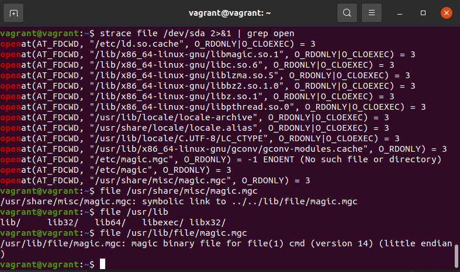

1. Какой системный вызов делает команда cd? В прошлом ДЗ мы выяснили, что cd не является самостоятельной программой, это shell builtin, поэтому запустить strace непосредственно на cd не получится. Тем не менее, вы можете запустить strace на /bin/bash -c 'cd /tmp'. В этом случае вы увидите полный список системных вызовов, которые делает сам bash при старте. Вам нужно найти тот единственный, который относится именно к cd. Обратите внимание, что strace выдаёт результат своей работы в поток stderr, а не в stdout.  
Решение: chdir("/tmp")
2. Попробуйте использовать команду file на объекты разных типов на файловой системе. Например:   
vagrant@netology1:~$ file /dev/tty  
/dev/tty: character special (5/0)  
vagrant@netology1:~$ file /dev/sda  
/dev/sda: block special (8/0)  
vagrant@netology1:~$ file /bin/bash  
/bin/bash: ELF 64-bit LSB shared object, x86-64 
Используя strace выясните, где находится база данных file на основании которой она делает свои догадки.  
Решение: 

3. Предположим, приложение пишет лог в текстовый файл. Этот файл оказался удален (deleted в lsof), однако возможности сигналом сказать приложению переоткрыть файлы или просто перезапустить приложение – нет. Так как приложение продолжает писать в удаленный файл, место на диске постепенно заканчивается. Основываясь на знаниях о перенаправлении потоков предложите способ обнуления открытого удаленного файла (чтобы освободить место на файловой системе).  
Решение: lsof -p 1508  
nano      1508 vagrant    4u   REG  253,0    12288  526898 /home/vagrant/.tst_bash.swp (deleted)  
echo '' >/proc/1508/fd/4
4. Занимают ли зомби-процессы какие-то ресурсы в ОС (CPU, RAM, IO)?  
Решение: Зомби процессы не занимают ресурсы в ОС, но запись остаентся в таблице процессов
5. В iovisor BCC есть утилита opensnoop:  
root@vagrant:~# dpkg -L bpfcc-tools | grep sbin/opensnoop  
/usr/sbin/opensnoop-bpfcc  
На какие файлы вы увидели вызовы группы open за первую секунду работы утилиты? Воспользуйтесь пакетом bpfcc-tools для Ubuntu 20.04. Дополнительные сведения по установке.  
Решение: 
6. Какой системный вызов использует uname -a? Приведите цитату из man по этому системному вызову, где описывается альтернативное местоположение в /proc, где можно узнать версию ядра и релиз ОС.  
Решение: Part of the utsname information is also accessible  via  /proc/sys/ker‐
       nel/{ostype, hostname, osrelease, version, domainname}
7. Чем отличается последовательность команд через ; и через && в bash? Например:   
root@netology1:~# test -d /tmp/some_dir; echo Hi  
Hi  
root@netology1:~# test -d /tmp/some_dir && echo Hi  
root@netology1:~#  
Есть ли смысл использовать в bash &&, если применить set -e?  
Решение: ; - разделитель последовательных команд  
&& - условный оператор  
Использовать && совместно с set -e не имеет смысла, т.к. set -e завершит сессию в случае безуспешного выполнения команды.
8. Из каких опций состоит режим bash set -euxo pipefail и почему его хорошо было бы использовать в сценариях?  
Решение: e завершает сессию, если выполненная команда дала ненулевой статус выхода;  
-u обрабатывает неустановленные или неопределенные переменные, за исключением специальных параметров, таких как подстановочные знаки (*) или «@», как ошибки во время раскрытия параметра;  
-x выводит команды и аргументы во время выполнения;  
-o pipefail при включении данной опции статус выхода из конвейера является значением последней (самой правой) команды, завершённой с ненулевым статусом, или ноль — если работа всех команд завершена успешно.
9. Используя -o stat для ps, определите, какой наиболее часто встречающийся статус у процессов в системе. В man ps ознакомьтесь (/PROCESS STATE CODES) что значат дополнительные к основной заглавной буквы статуса процессов. Его можно не учитывать при расчете (считать S, Ss или Ssl равнозначными).  
Решение: 1) S*(S,S+,Ss,Ssl,Ss+) - Процессы ожидающие завершения (спящие с прерыванием "сна")  
2)I*(I,I<) - фоновые(бездействующие) процессы ядра