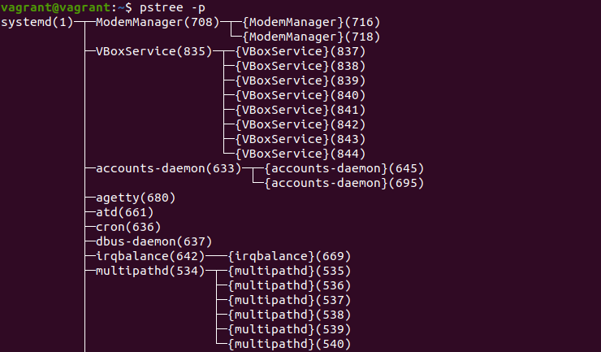

1. Какого типа команда cd? Попробуйте объяснить, почему она именно такого типа; опишите ход своих мыслей, если считаете что она могла бы быть другого типа.  
Решение: vagrant@vagrant:~$ type cd  
cd is a shell builtin - это встроенная команда bash, логично использовать встроенную команду для смены деректории, а не устанавливать внешнюю программу
2. Какая альтернатива без pipe команде grep <some_string> <some_file> | wc -l? man grep поможет в ответе на этот вопрос. Ознакомьтесь с документом о других подобных некорректных вариантах использования pipe.  
Решение: grep <some_string> <some_file> -c
3. Какой процесс с PID 1 является родителем для всех процессов в вашей виртуальной машине Ubuntu 20.04?  
Решение:  
4. Как будет выглядеть команда, которая перенаправит вывод stderr ls на другую сессию терминала?  
Решение: ls -l 2>/dev/pts/2(граф. оболочка) или  ls -l 2>/dev/tty2
5. Получится ли одновременно передать команде файл на stdin и вывести ее stdout в другой файл? Приведите работающий пример.  
Решение:  
vagrant@vagrant:~$ echo 'Test' > test.txt  
vagrant@vagrant:~$ cat < test.txt > test_2.txt  
vagrant@vagrant:~$ cat test_2.txt   
Test
6. Получится ли находясь в графическом режиме, вывести данные из PTY в какой-либо из эмуляторов TTY? Сможете ли вы наблюдать выводимые данные?  
Решение: Да, ls -l >/dev/tty2
7. Выполните команду bash 5>&1. К чему она приведет? Что будет, если вы выполните echo netology > /proc/$$/fd/5? Почему так происходит?  
Решение:  
bash 5>&1 - создаем дескриптор 5 и перенаправляем в дескриптор 1 (stdout)  
echo netology > /proc/$$/fd/5 - так как мы перенаправили дескриптор 5 в 1, получаем в терминале запись netology
8. Получится ли в качестве входного потока для pipe использовать только stderr команды, не потеряв при этом отображение stdout на pty? Напоминаем: по умолчанию через pipe передается только stdout команды слева от | на stdin команды справа. Это можно сделать, поменяв стандартные потоки местами через промежуточный новый дескриптор, который вы научились создавать в предыдущем вопросе.  
Решение:  
vagrant@vagrant:~$ cat test.txt 5>&2 2>&1 1>&5 | grep 'My_test'  
Test  
vagrant@vagrant:~$ cat test.txt 5>&2 2>&1 1>&5 | grep 'Test'  
Test
9. Что выведет команда cat /proc/$$/environ? Как еще можно получить аналогичный по содержанию вывод?  
Решение: изначальные переменные окружения для процесса запустившего данную команду. Аналогичные команды для вывода printenv, env.
10. Используя man, опишите что доступно по адресам /proc/PID/cmdline, /proc/PID/exe  
Решение: /proc/PID/cmdline - хранится команда запустившая процесс  
/proc/PID/exe - символическая ссылка указывающую на исполняемый файл процесса загруженный в память ядра
11. Узнайте, какую наиболее старшую версию набора инструкций SSE поддерживает ваш процессор с помощью /proc/cpuinfo  
Решение: vagrant@vagrant:~$ grep -i sse /proc/cpuinfo  
sse4_2
12. При открытии нового окна терминала и vagrant ssh создается новая сессия и выделяется pty. Это можно подтвердить командой tty, которая упоминалась в лекции 3.2.  
Однако:
vagrant@netology1:~$ ssh localhost 'tty'  
not a tty  
Решение: надо добавить ключь ssh -t (добавление псевдотерминала)
13. Бывает, что есть необходимость переместить запущенный процесс из одной сессии в другую. Попробуйте сделать это, воспользовавшись reptyr. Например, так можно перенести в screen процесс, который вы запустили по ошибке в обычной SSH-сессии.  
Решение: vagrant@vagrant:~$ top  
[1]+  Stopped                 top  
vagrant@vagrant:~$ bg  
[1]+ top &  
vagrant@vagrant:~$ 
jobs -l  
[1]+  2200 Stopped (signal)        top  
vagrant@vagrant:~$ sudo reptyr -T 2200
И зависает, что делать пока незнаю
14. sudo echo string > /root/new_file не даст выполнить перенаправление под обычным пользователем, так как перенаправлением занимается процесс shell'а, который запущен без sudo под вашим пользователем. Для решения данной проблемы можно использовать конструкцию echo string | sudo tee /root/new_file. Узнайте что делает команда tee и почему в отличие от sudo echo команда с sudo tee будет работать.  
Решение: принимает данные из одного источника и может сохранять их на выходе в нескольких местах, cледовательно если она запущена от sudo то доступна запись в файл
